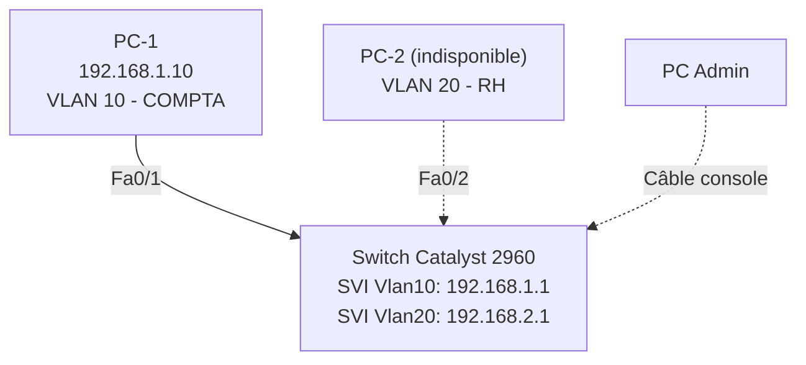

# Projet Réseau — Segmentation VLAN sur Switch Cisco Catalyst 2960

## 🎯 Objectif

Segmenter logiquement un switch physique Cisco Catalyst 2960 en deux réseaux
isolés (VLAN) pour séparer le trafic de deux services fictifs d'une
entreprise : **Comptabilité** et **Ressources Humaines**. Démontrer, par un
test réel, que deux appareils dans des VLAN différents ne peuvent pas
communiquer sans routeur, même s'ils sont branchés sur le même switch.

## 🧰 Matériel utilisé

| Équipement            | Rôle                                   |
|------------------------|-----------------------------------------|
| Switch Cisco Catalyst 2960 (24 ports PoE) | Équipement configuré |
| Câble console RJ45 → USB | Accès CLI via port CONSOLE |
| PC Windows (x1)        | Accès terminal (PuTTY) + test ping |
| Logiciel PuTTY          | Émulation terminal série (9600 bauds) |

## 🗺️ Topologie



> PC-2 étant indisponible pendant la session pratique, le test d'isolation a
> été réalisé en donnant une adresse IP à chaque VLAN directement sur le
> switch (interfaces virtuelles SVI), ce qui permet de prouver l'isolation
> sans dépendre d'un second poste.

## ⚙️ Configuration appliquée

```
enable
configure terminal

vlan 10
 name COMPTA
exit

vlan 20
 name RH
exit

interface fastethernet 0/1
 switchport mode access
 switchport access vlan 10
exit

interface fastethernet 0/2
 switchport mode access
 switchport access vlan 20
exit

interface vlan 10
 ip address 192.168.1.1 255.255.255.0
 no shutdown
exit

interface vlan 20
 ip address 192.168.2.1 255.255.255.0
 no shutdown
exit

copy running-config startup-config
```

## ✅ Vérification

**Table des VLAN (`show vlan brief`) :**

```
VLAN Name                             Status    Ports
---- -------------------------------- --------- -------------------------------
1    default                          active    Fa0/3, Fa0/4, ... Gi0/1, Gi0/2
10   COMPTA                           active    Fa0/1
20   RH                               active    Fa0/2
```

**État des interfaces (`show ip interface brief`) :**

```
Vlan10   192.168.1.1   up   up      ← actif car Fa0/1 (dans VLAN 10) est connecté
Vlan20   192.168.2.1   up   down    ← inactif car aucun port actif n'est dans VLAN 20
```

> 💡 **Point clé appris** : une interface virtuelle VLAN (SVI) ne passe en
> "up" que s'il existe au moins un port physique actif appartenant à ce VLAN.

## 🧪 Test d'isolation (preuve)

**Ping depuis PC-1 vers son propre VLAN (192.168.1.1) :**

```
Reply from 192.168.1.1: bytes=32 time=1ms TTL=255
Packets: Sent = 4, Received = 4, Lost = 0 (0% loss)
```
→ ✅ Succès, PC-1 communique normalement avec son VLAN (10).

**Ping depuis PC-1 vers le VLAN 20 (192.168.2.1) :**

```
Request timed out. (x4)
Packets: Sent = 4, Received = 0, Lost = 4 (100% loss)
```
→ ❌ Échec attendu : sans routeur pour faire de l'inter-VLAN routing, deux
VLAN différents sont deux réseaux totalement isolés, même sur le même switch
physique.

## 📸 Captures d'écran

| Étape | Capture |
|-------|---------|
| Accès console (`User Access Verification`) | `assets/01-console-access.png` |
| Création VLAN 10 (COMPTA) | `assets/02-vlan10-creation.png` |
| Création VLAN 20 (RH) | `assets/03-vlan20-creation.png` |

## 📚 Compétences démontrées

- Accès et configuration CLI d'un switch Cisco via câble console
- Création et nommage de VLAN
- Assignation de ports en mode access
- Configuration d'interfaces virtuelles (SVI) pour test et diagnostic
- Vérification via `show vlan brief` / `show interfaces status` / `show ip interface brief`
- Compréhension et démonstration pratique de l'isolation entre domaines de broadcast

---
*Projet réalisé dans le cadre d'une formation pratique réseau — Bloc 3 : Switching, Notion 1 : VLAN.*
