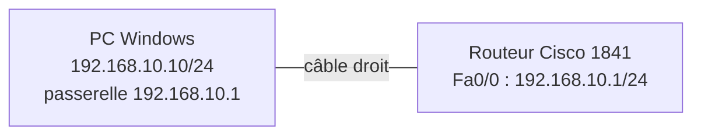
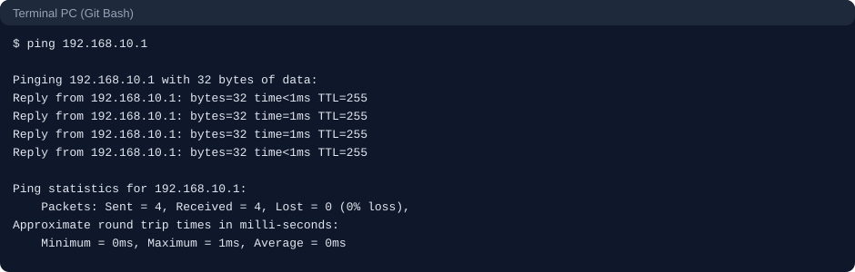
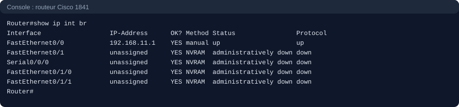
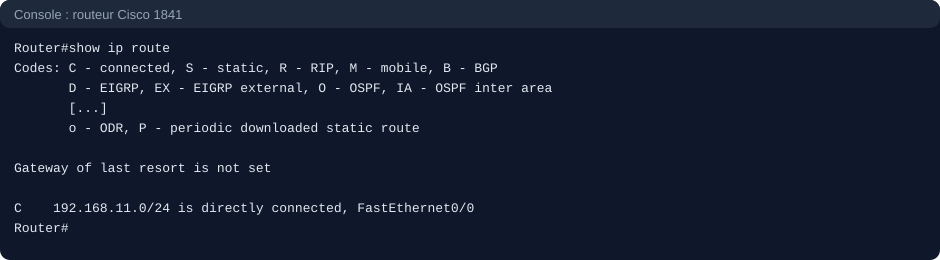
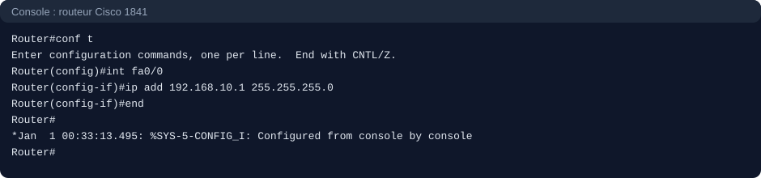
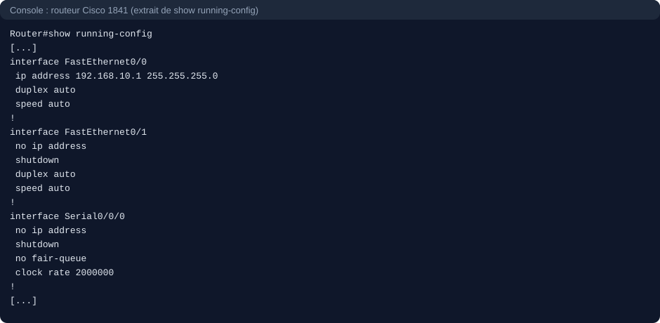

# Projet : Dépannage du routage (méthode du bas vers le haut, incident volontaire sur Cisco 1841)

## Contexte

Ce projet fait suite à `projet-routage-bases`. Il porte sur la **méthode de dépannage** d'un lien routé : savoir où chercher, dans quel ordre, et prouver qu'une réparation fonctionne. Il a été réalisé sur du **matériel réel**, sans simulateur.

Les images de ce dossier reproduisent les sorties console relevées lors de la pratique sur du matériel réel.

## Objectifs

- Appliquer une méthode de diagnostic du bas vers le haut : couche 1, puis 2, puis 3.
- Lire correctement les résultats de `ping` : savoir **qui** a produit un message d'erreur.
- Utiliser `show ip interface brief`, `show ip route` et `show running-config` pour trouver une cause.
- Corriger un incident de configuration et **prouver** la réparation par un test.
- Tester dans les deux sens : depuis le PC et depuis le routeur.

## Matériel utilisé

| Équipement | Rôle |
|---|---|
| Routeur Cisco 1841 (IOS 12.4(24)T3) | Routeur testé |
| PC Windows | Machine cliente (carte Wi-Fi désactivée pendant les tests) |
| Câble console RJ45 → USB | Accès à la console du routeur (9600 bauds) |
| Câble Ethernet droit | Liaison `Fa0/0` ↔ PC |

## Topologie



Réseau de référence : `192.168.10.0/24`.

## Méthode de dépannage

On remonte les couches une par une et on s'arrête à la première qui pose problème, parce que chaque couche dépend de celle du dessous.

| Étape | Couche | On vérifie | Outil |
|---|---|---|---|
| 1 | Physique | Câble, voyant, bon port | Voyants, `show ip interface brief` (Status) |
| 2 | Liaison | Interface `up/up`, ARP résolu | `show ip interface brief` (Protocol), `show ip arp` |
| 3 | Réseau | Adresse IP, masque, passerelle, routes | `ipconfig`, `show ip route`, `ping` |
| 4 | Chemin | Où le paquet s'arrête | `tracert`, `traceroute` |
| 5 | Configuration | La configuration correspond-elle au plan ? | `show running-config` |

### Lecture de `show ip interface brief`

| Status | Protocol | Lecture |
|---|---|---|
| `administratively down` | `down` | Interface désactivée par `shutdown` |
| `down` | `down` | Problème de couche 1 (câble, port, équipement distant) |
| `up` | `down` | Problème de couche 2 (encapsulation, keepalives) |
| `up` | `up` | Couches 1 et 2 correctes, on passe à la couche 3 |

### Lecture d'un `ping`

| Résultat | Signification |
|---|---|
| `Reply from <destination>` | La destination répond |
| `Reply from <routeur>: Destination host unreachable` | Un routeur a reçu le paquet mais n'a pas de route |
| `Reply from <le PC lui-même>: Destination host unreachable` | Le paquet n'est pas parti vers le routeur (par exemple ARP sans réponse) |
| `Request timed out` | Aucune réponse : ambigu, il faut un `traceroute` |

## L'incident

### État de départ

Le lien fonctionne : le PC joint son routeur.



### Injection de la panne (sur le routeur 1841)

```
configure terminal
interface fa0/0
ip address 192.168.11.1 255.255.255.0
end
```

La configuration correcte restait enregistrée dans la startup-config. Aucun `write memory` n'a été tapé pendant l'incident.

### Symptôme

Le ping vers `192.168.10.1` renvoie `Destination host unreachable`, mais la réponse vient de **`192.168.10.10`, le PC lui-même**, et non du routeur. Le paquet n'a donc pas atteint le routeur. Les statistiques affichent `Received = 4, Lost = 0`, mais ce sont des messages d'erreur du PC, pas des réponses du routeur.


### Diagnostic, étape par étape

**Couches 1 et 2 (sur le routeur).**

```
show ip interface brief
```

`Fa0/0` est en `up/up` : le câble et la liaison fonctionnent, on remonte. La colonne `Method` affiche `manual`, alors que les autres interfaces affichent `NVRAM`, ce qui signale une adresse saisie pendant la session et non enregistrée.



**Couche 3 (sur le routeur).**

```
show ip route
```

La seule route est `C 192.168.11.0/24`. Le routeur pense que son réseau est `192.168.11.0/24`, alors que le PC est dans `192.168.10.0/24`.



**Hypothèse.** Le PC envoie une requête ARP pour `192.168.10.1`. Aucun équipement ne possède cette adresse sur le câble, donc il n'y a pas de réponse, et le PC produit lui-même le message d'erreur. L'hypothèse a été confirmée par la table de routage avant toute correction.

### Correction (sur le routeur 1841)

```
configure terminal
interface fa0/0
ip address 192.168.10.1 255.255.255.0
end
```

Le choix de corriger le routeur et non le PC vient du plan d'adressage : le PC était déjà configuré selon le plan.



### Preuve de la réparation

La table de routage contient de nouveau la route `C 192.168.10.0/24`.


Les réponses viennent de `192.168.10.1` avec `TTL=255`. Le premier ping a perdu un paquet sur quatre, puis le second ping est à 0 % de perte. Je n'ai pas vérifié la cause de cette perte initiale : l'hypothèse la plus probable est la résolution ARP après la panne.


### Test dans l'autre sens (depuis le routeur)

```
ping 192.168.10.10
```

Le résultat `!!!!!` (5/5) prouve que le lien fonctionne dans les deux sens, et que le pare-feu Windows ne bloque pas l'ICMP entrant sur cette carte.


### Contrôle de la configuration

```
show running-config
```

Seul le bloc des interfaces est reproduit ici : `Fa0/0` porte `192.168.10.1/24` sans `shutdown`, et les interfaces inutilisées sont désactivées. Les lignes d'authentification de la configuration ne sont volontairement pas publiées.



## Déroulé de l'incident

| Étape | Observation | Conclusion |
|---|---|---|
| Symptôme | `Destination host unreachable` venant du PC (`192.168.10.10`) | Le paquet n'a pas atteint le routeur |
| Couches 1 et 2 | `Fa0/0` en `up/up` | Câble et liaison corrects |
| Couche 3 | Routeur en `192.168.11.1`, PC en `192.168.10.10` | Les deux ne sont pas dans le même réseau |
| Confirmation | `show ip route` : `C 192.168.11.0/24` seulement | Le routeur ne connaît pas le réseau du PC |
| Correction | `ip address 192.168.10.1 255.255.255.0` | Route `C 192.168.10.0/24` rétablie |
| Preuve | Ping dans les deux sens | Réparation confirmée |

## Ce que j'ai retenu

- **La source d'un message d'erreur** indique qui l'a produit : le PC ou le routeur. Elle oriente le diagnostic.
- **Les statistiques d'un ping peuvent tromper** : `Received = 4` peut ne compter que des messages d'erreur. Il faut lire le contenu des lignes.
- **`Method manual` ou `NVRAM`** dans `show ip interface brief` permet de repérer une configuration modifiée et non sauvegardée.
- **Une réparation se prouve par un test**, pas par l'absence de message d'erreur.
- **`write memory`** sauvegarde la running-config (RAM) dans la startup-config (NVRAM) : sans elle, une configuration disparaît au redémarrage.
- **Une carte Wi-Fi active** peut faire partir un test par un autre chemin que le câble testé.
- **Une configuration complète ne se publie pas** : elle contient des mots de passe, parfois chiffrés de façon réversible.

## Compétences démontrées

- Diagnostic structuré du bas vers le haut sur un équipement Cisco.
- Lecture de `show ip interface brief`, `show ip route` et `show running-config`.
- Interprétation précise des messages `ping` (origine de la réponse).
- Formulation d'une hypothèse, vérification, correction, puis preuve par un test.
- Test bidirectionnel (PC vers routeur et routeur vers PC).
- Réflexe de sécurité : ne pas publier les éléments d'authentification.

## Remise en état après les tests

- Réactiver la carte Wi-Fi du PC.
- Remettre la carte Ethernet du PC en **Obtenir une adresse IP automatiquement** si l'IP fixe n'est plus nécessaire.
