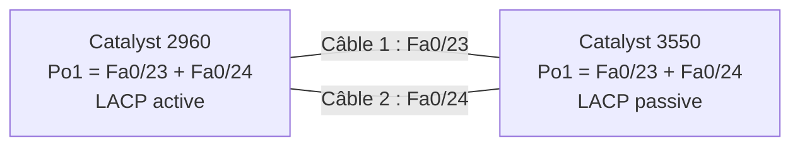
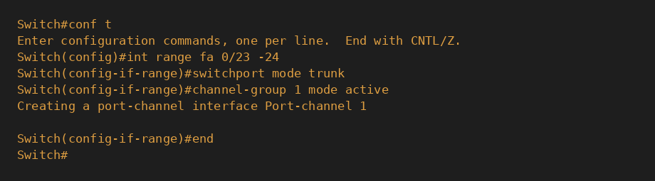
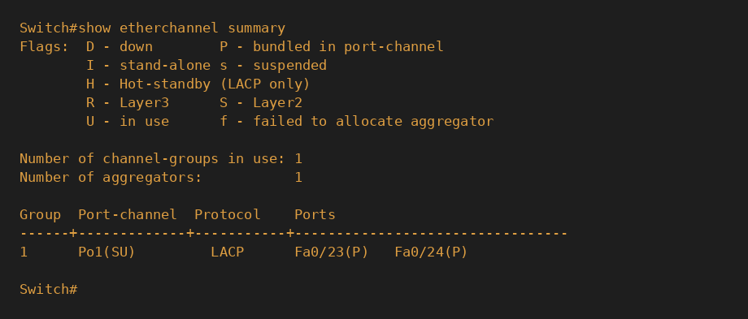
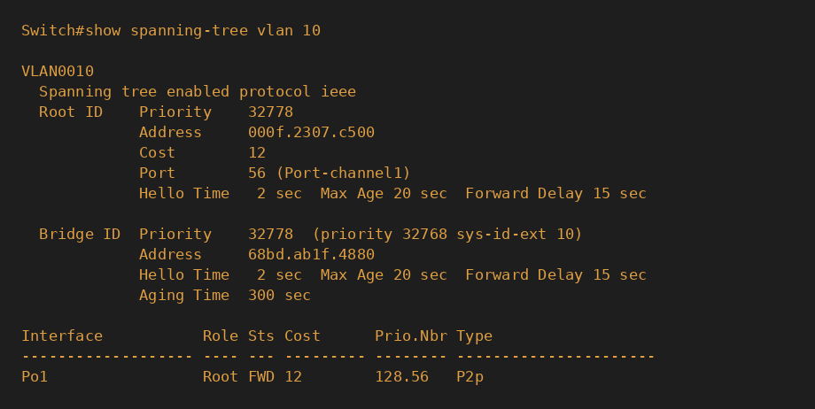

# Projet Réseau — Agrégation de liens avec EtherChannel (LACP)

## 🎯 Contexte

Dans le projet précédent (Spanning Tree), un lien redondant entre deux
switches était **bloqué par STP** : un câble installé mais inutilisé tant que
le lien principal fonctionnait, et un basculement de 30 à 50 secondes en cas
de panne. Deux défauts pour une entreprise : bande passante gaspillée et
coupure lors du basculement.

## 🎯 Objectif

Regrouper deux câbles physiques entre deux switches en **un seul lien
logique** (EtherChannel, protocole standard **LACP 802.3ad**) afin que les
deux câbles travaillent simultanément, que STP ne voie plus qu'un seul lien
(donc plus de port bloqué), et que la panne d'un câble n'entraîne aucune
coupure.

## 🧰 Matériel utilisé

| Équipement | Rôle |
|------------|------|
| Cisco Catalyst 2960 | Côté LACP `active` |
| Cisco Catalyst 3550 | Côté LACP `passive` |
| 2 câbles Ethernet droits | Liens agrégés (Fa0/23 et Fa0/24) |
| Câble console RJ45 → USB | Accès CLI |

## 🗺️ Topologie



## ⚙️ Configuration appliquée

Méthode : configuration des deux côtés **avant** le câblage, pour éviter
toute boucle temporaire.

**Remise à zéro des ports (2960 et 3550) :**
```
default interface range fastethernet 0/23 - 24
```

**Catalyst 2960 (initiateur LACP) :**
```
interface range fastethernet 0/23 - 24
 switchport mode trunk
 channel-group 1 mode active
```

**Catalyst 3550 (répondeur LACP) :**
```
interface range fastethernet 0/23 - 24
 switchport trunk encapsulation dot1q
 switchport mode trunk
 channel-group 1 mode passive
```

> Le 3550 exige de préciser l'encapsulation (`dot1q`) avant `mode trunk`,
> contrairement au 2960 qui ne supporte que 802.1Q.



## 🧪 Résultats des tests

> Les captures ci-dessous ont été reconstituées visuellement à partir des
> sorties de commande réelles obtenues pendant la session (mêmes valeurs,
> même contenu exact).

**1. Avant câblage — canal créé, ports down (`SD` / `D`) :**


**2. Après câblage — canal formé et actif (`SU`, ports `P` = bundled) :**



**3. Spanning Tree ne voit plus qu'un seul lien logique :**



| | Sans EtherChannel (projet STP) | Avec EtherChannel |
|---|---|---|
| Interfaces vues par STP | Fa0/23 et Fa0/24 séparés | Po1 unique |
| Port bloqué | Oui (Fa0/24 en `Altn BLK`) | Aucun |
| Bande passante utile | 100 Mb/s | 200 Mb/s |
| Coût STP | 19 | 12 |

**4. Panne d'un câble (Fa0/24 débranché) — le canal reste actif :**


**5. Rétablissement — réintégration automatique du port :**


→ Le lien logique `Po1` est resté `SU` pendant toute la panne : aucune
coupure, alors que le basculement STP classique demandait 30 à 50 secondes.
Le port rebranché a rejoint le groupe sans aucune commande manuelle.

## 📌 Points de vigilance

- Tous les ports d'un groupe doivent avoir la même vitesse, le même duplex,
  le même mode (trunk/access) et les mêmes VLAN, sinon le groupe ne se forme pas.
- Au moins un côté doit être `active` : deux côtés `passive` ne forment rien.
- Le mode `on` (sans négociation) est déconseillé : une erreur de config
  d'un côté peut créer une boucle.

## 📚 Compétences démontrées

- Configuration d'un EtherChannel LACP entre deux switches de générations différentes
- Compréhension des rôles `active` / `passive` et du choix de LACP (standard) face à PAgP (propriétaire Cisco)
- Lecture de `show etherchannel summary` (flags `S`, `U`, `P`, `D`)
- Analyse de l'impact sur Spanning Tree (suppression du port bloqué, changement de coût)
- Test de résilience par panne d'un câble et constat d'une continuité de service sans convergence

---
*Projet réalisé dans le cadre d'une formation pratique réseau — Bloc 3 : Switching, Notion 4 : EtherChannel.*
