# Projet Final — Réseau d'entreprise complet : VLAN, Trunking, EtherChannel, STP, Port Security et DHCP

## 🎯 Contexte

Ce projet est l'aboutissement d'une série de projets pratiques consacrés au
**Switching** (Bloc 3 de la formation), réalisés sur du matériel Cisco réel
(3 switches) et menés étape par étape comme un vrai déploiement
d'entreprise. Il reprend le cahier des charges d'une PME fictive répartie
sur plusieurs zones :

> - 3 services isolés logiquement : **Comptabilité**, **Ressources
>   Humaines**, **Production**
> - Un réseau **résilient** : aucune coupure de service en cas de panne
>   d'un câble
> - Des ports utilisateurs **sécurisés** contre le branchement d'appareils
>   non autorisés
> - Un adressage IP **automatique** par service

Contrairement aux projets précédents qui traitaient chaque notion
isolément (VLAN, STP, Port Security, EtherChannel), ce projet les
**combine toutes dans une seule topologie de production**, exactement
comme elles coexistent dans un vrai réseau d'entreprise.

## 🎯 Objectifs

- Concevoir et déployer un réseau à 3 switches combinant VLAN, trunking
  802.1Q, agrégation de liens (EtherChannel/LACP), redondance protégée par
  Spanning Tree, sécurité des ports d'accès et service DHCP centralisé
- Appliquer une méthodologie rigoureuse : toute la configuration logique
  posée **avant** tout câblage de liens redondants, pour une convergence
  propre en une seule fois
- Valider chaque brique par des tests réels : pannes simulées,
  branchements non autorisés, mesure du temps de rétablissement

## 🧰 Matériel utilisé

| Équipement | Rôle dans la topologie |
|------------|--------------------------|
| Cisco Catalyst 2960 (24 ports PoE) | Switch cœur — root bridge, DHCP centralisé |
| Cisco Catalyst 3550 | Switch de distribution — VLAN PRODUCTION, membre EtherChannel |
| Cisco Catalyst 2950 | Switch de distribution — VLAN COMPTA, lien redondant |
| Câble Ethernet croisé (fabriqué maison) | Liaison redondante 2950 ↔ 3550 |
| Câble console RJ45 → USB | Accès CLI |
| PC Windows (plusieurs) | Tests DHCP et Port Security |

## 🗺️ Topologie complète

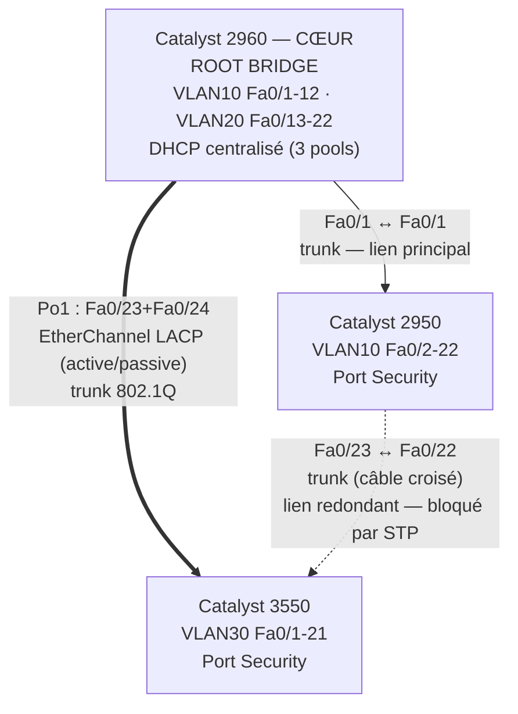

## 🌐 Plan d'adressage

| VLAN | Nom | Réseau | Passerelle | Switch(es) porteur(s) |
|------|-----|--------|------------|------------------------|
| 10 | COMPTA | 192.168.10.0/24 | 192.168.10.1 | 2960 (Fa0/1-12) + 2950 (Fa0/2-22) |
| 20 | RH | 192.168.20.0/24 | 192.168.20.1 | 2960 (Fa0/13-22) |
| 30 | PRODUCTION | 192.168.30.0/24 | 192.168.30.1 | 3550 (Fa0/1-21) |

Le serveur DHCP est centralisé sur le **2960** uniquement.

## 🧭 Méthodologie

Leçon tirée des projets précédents (recalculs STP en cascade lors d'une
mauvaise séquence) : toute la configuration logique — VLAN sur les 3
switches, root bridge, trunks, EtherChannel — est posée **avant** tout
câblage créant une boucle. Le câblage suit un ordre strict :

1. Les 2 câbles de l'EtherChannel (2960 ↔ 3550)
2. Le lien principal (2960 ↔ 2950)
3. En tout dernier, le lien redondant qui ferme le triangle (2950 ↔ 3550,
   avec le câble croisé)

Chaque switch a d'abord été remis à zéro (`erase startup-config` +
`delete flash:vlan.dat` + `reload`) pour repartir sur une base
parfaitement propre, sans reliquat des projets précédents.

## ⚙️ Configuration détaillée par switch

### Catalyst 2960 (cœur de réseau)

**Remise à zéro :**
```
erase startup-config
delete flash:vlan.dat
reload
```

**Phase A — VLAN et ports clients :**
```
vlan 10
 name COMPTA
vlan 20
 name RH
vlan 30
 name PRODUCTION

interface range fastethernet 0/1 - 12
 switchport mode access
 switchport access vlan 10

interface range fastethernet 0/13 - 22
 switchport mode access
 switchport access vlan 20
```

**Phase B — Root bridge, EtherChannel, trunking :**
```
spanning-tree vlan 10,20,30 root primary

interface range fastethernet 0/23 - 24
 switchport mode trunk
 channel-group 1 mode active

interface fastethernet 0/1
 switchport mode trunk
```

**Phase C — Port Security (ports clients uniquement, Fa0/1 exclu — voir incident ci-dessous) :**
```
interface range fastethernet 0/2 - 22
 switchport port-security
 switchport port-security maximum 1
 switchport port-security mac-address sticky
 switchport port-security violation shutdown
```

**Phase D — DHCP centralisé :**
```
interface vlan 10
 ip address 192.168.10.1 255.255.255.0
 no shutdown
interface vlan 20
 ip address 192.168.20.1 255.255.255.0
 no shutdown
interface vlan 30
 ip address 192.168.30.1 255.255.255.0
 no shutdown

ip dhcp excluded-address 192.168.10.1
ip dhcp excluded-address 192.168.20.1
ip dhcp excluded-address 192.168.30.1

ip dhcp pool VLAN10-COMPTA
 network 192.168.10.0 255.255.255.0
 default-router 192.168.10.1

ip dhcp pool VLAN20-RH
 network 192.168.20.0 255.255.255.0
 default-router 192.168.20.1

ip dhcp pool VLAN30-PRODUCTION
 network 192.168.30.0 255.255.255.0
 default-router 192.168.30.1

copy running-config startup-config
```

### Catalyst 2950 (distribution — COMPTA)

**Remise à zéro** : identique au 2960.

**Phase A :**
```
vlan 10
 name COMPTA
vlan 20
 name RH
vlan 30
 name PRODUCTION

interface range fastethernet 0/2 - 22
 switchport mode access
 switchport access vlan 10
```

**Phase B — Trunking (lien principal + lien redondant) :**
```
interface fastethernet 0/1
 switchport mode trunk

interface fastethernet 0/23
 switchport mode trunk
```

**Phase C — Port Security :**
```
interface range fastethernet 0/2 - 22
 switchport port-security
 switchport port-security maximum 1
 switchport port-security mac-address sticky
 switchport port-security violation shutdown

copy running-config startup-config
```

### Catalyst 3550 (distribution — PRODUCTION)

**Remise à zéro** : identique aux deux autres.

**Phase A :**
```
vlan 10
 name COMPTA
vlan 20
 name RH
vlan 30
 name PRODUCTION

interface range fastethernet 0/1 - 22
 switchport mode access
 switchport access vlan 30
```

**Phase B — EtherChannel et lien redondant :**
```
interface range fastethernet 0/23 - 24
 switchport trunk encapsulation dot1q
 switchport mode trunk
 channel-group 1 mode passive

interface fastethernet 0/22
 switchport trunk encapsulation dot1q
 switchport mode trunk
```

*(Fa0/22 bascule d'un port client access vers un port trunk dédié au lien
redondant, ramenant les ports clients disponibles à Fa0/1-21.)*

**Phase C — Port Security :**
```
interface range fastethernet 0/1 - 21
 switchport port-security
 switchport port-security maximum 1
 switchport port-security mac-address sticky
 switchport port-security violation shutdown

copy running-config startup-config
```

## 🔌 Câblage (ordre exact suivi)

1. **2960 Fa0/23** ↔ **3550 Fa0/23** (EtherChannel, câble droit)
2. **2960 Fa0/24** ↔ **3550 Fa0/24** (EtherChannel, câble droit)
3. **2960 Fa0/1** ↔ **2950 Fa0/1** (lien principal, câble droit)
4. **2950 Fa0/23** ↔ **3550 Fa0/22** (lien redondant, **câble croisé** — ni
   le 2950 ni le 3550 ne disposent d'Auto-MDIX sur leurs ports
   FastEthernet)

## 📸 Vérifications et résultats

**EtherChannel formé (2960) :**

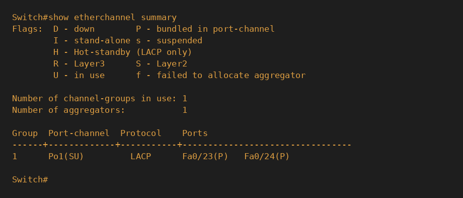

**Root bridge confirmé sur le 2960, avant fermeture de la boucle :**

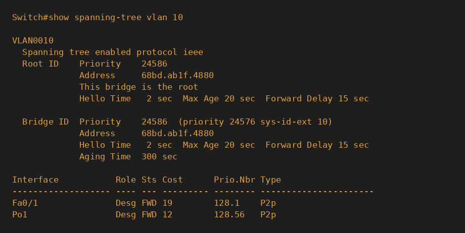

**Boucle fermée — STP bloque proprement le lien redondant (2950) :**

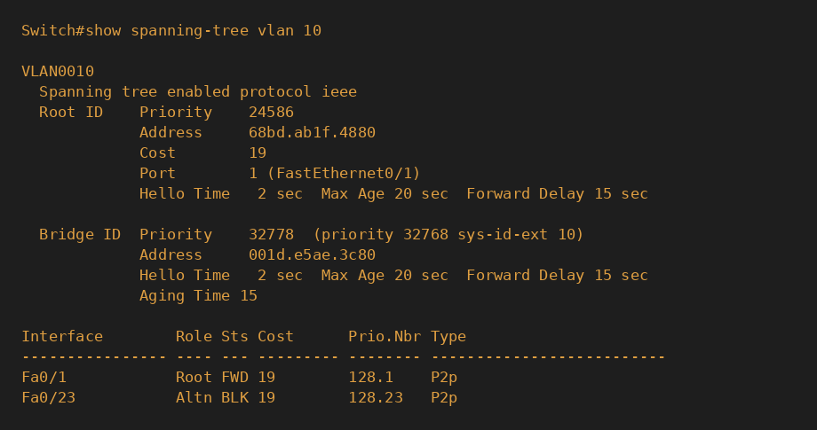

**Les 3 VLAN actifs sur le 2960, dont VLAN30 sans port physique local :**

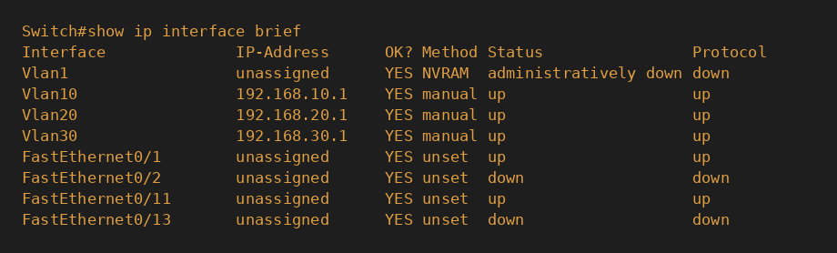

**Port Security actif sur les ports clients du 2960 :**

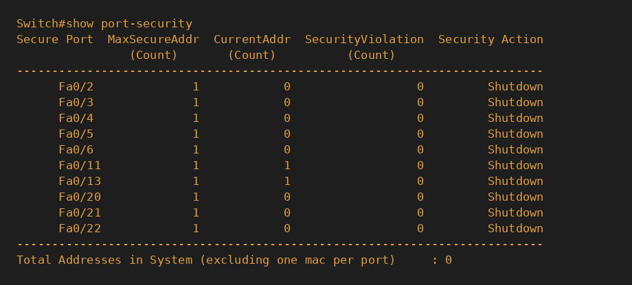

> Les captures ci-dessus et ci-dessous ont été reconstituées visuellement
> à partir des sorties de commande réelles obtenues pendant la session
> (mêmes valeurs, mêmes ports, même contenu exact).

## 🐞 Incident rencontré et corrigé — Port Security sur un port trunk

**Symptôme :** après application de Port Security en Phase C sur la plage
`fastethernet 0/1 - 22` du 2960, le lien vers le 2950 (Fa0/1) est passé en
`err-disabled`, coupant la connectivité vers tout le switch 2950.

**Cause :** la plage utilisée incluait par erreur **Fa0/1**, qui est en
réalité le port **trunk** vers le 2950 (configuré en Phase B), pas un port
client. Port Security limite un port à un nombre restreint d'adresses MAC
— or un trunk voit légitimement circuler de nombreuses adresses MAC
différentes (tout le trafic du 2950 et, via lui, potentiellement d'autres
segments). Dès qu'une deuxième adresse MAC est apparue sur ce port, la
violation a été déclenchée.

**Correction :**
```
interface fastethernet 0/1
 no switchport port-security
 no switchport port-security violation shutdown
 no switchport port-security mac-address sticky
 shutdown
 no shutdown
```

**Leçon retenue :** Port Security ne doit jamais être appliqué sur un lien
trunk ou inter-switch. Lors de l'utilisation de `interface range`, toujours
vérifier que la plage ne recouvre pas un port ayant un rôle d'infrastructure
(trunk, EtherChannel, lien montant) plutôt qu'un rôle de port client.

**Violation Port Security détectée lors du test volontaire (2950, Fa0/6) :**

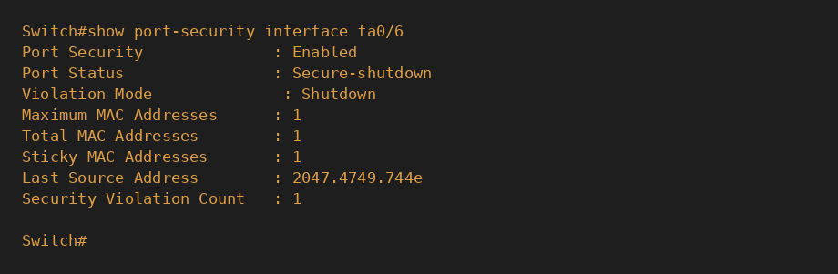

## 🧪 Tests de résilience

**Test 1 — Panne d'un câble de l'EtherChannel :**

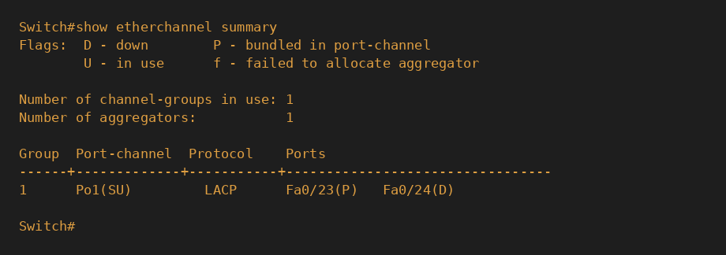

→ `Po1` reste `SU` (in use) malgré la perte d'un des deux câbles : aucune
coupure de service, le canal continue de fonctionner sur le câble restant.

**Test 2 — Panne du lien STP principal (2950 ↔ 2960) :**

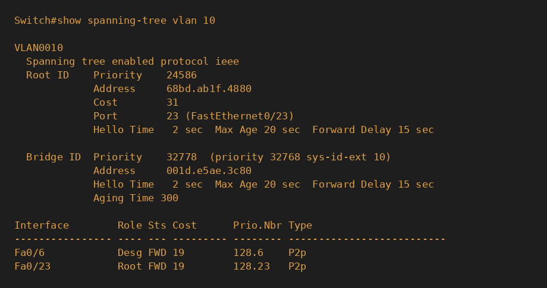

→ Le lien redondant (Fa0/23, via le 3550) passe automatiquement en
`Root FWD` en moins d'une minute, avec un coût recalculé (31, reflétant
le chemin plus long via le triangle).

**Retour à la normale après rétablissement du lien principal :**

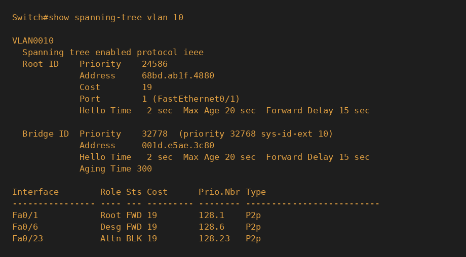

## 🧪 Tests DHCP — les 3 VLAN, sur les 3 switches

| VLAN | Switch de test | IP obtenue | Passerelle | Résultat |
|------|-----------------|------------|------------|----------|
| 10 (COMPTA) | 2950 (le plus éloigné) | 192.168.10.2 | 192.168.10.1 | ✅ |
| 20 (RH) | 2960 (direct) | 192.168.20.2 | 192.168.20.1 | ✅ |
| 30 (PRODUCTION) | 3550 (via EtherChannel) | 192.168.30.2 | 192.168.30.1 | ✅ |


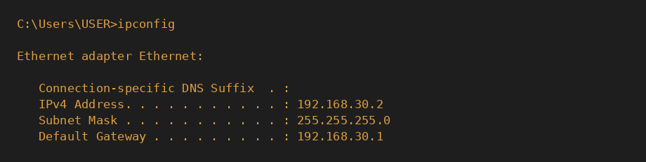

Les 3 VLAN, répartis sur 3 switches physiques, reçoivent correctement leur
adressage depuis le serveur DHCP centralisé — y compris à travers
l'EtherChannel et le lien inter-switch le plus éloigné du cœur de réseau.

## 📚 Compétences démontrées

- Conception et déploiement d'une architecture réseau multi-switch combinant 5 notions de switching dans une topologie unique et cohérente
- Méthodologie de configuration rigoureuse (logique avant câblage) pour une convergence Spanning Tree propre
- Segmentation VLAN répartie sur plusieurs équipements physiques
- Agrégation de liens EtherChannel LACP (mode `active`/`passive`) et compréhension de son impact sur le calcul Spanning Tree (suppression du blocage, réduction du coût)
- Configuration explicite d'un root bridge et gestion d'une topologie redondante en triangle
- Sécurisation des ports d'accès (Port Security sticky, violation shutdown) et diagnostic d'une erreur de configuration sur un port d'infrastructure
- Déploiement d'un service DHCP centralisé multi-VLAN, validé à travers plusieurs sauts de switches
- Tests de résilience réels : panne de câble EtherChannel, panne de lien STP, violation de sécurité physique — avec mesure du comportement et du temps de rétablissement
- Rédaction d'une documentation technique complète (topologie, configuration, incidents, résultats) au niveau attendu en entreprise

---
*Projet réalisé dans le cadre d'une formation pratique réseau — Bloc 3 : Switching, projet de conclusion combinant VLAN, Trunking, EtherChannel, Spanning Tree, Port Security et DHCP.*

Master IT Fidele SHABANI
