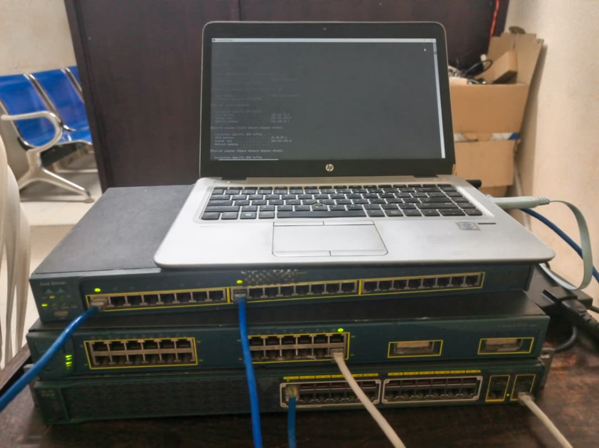
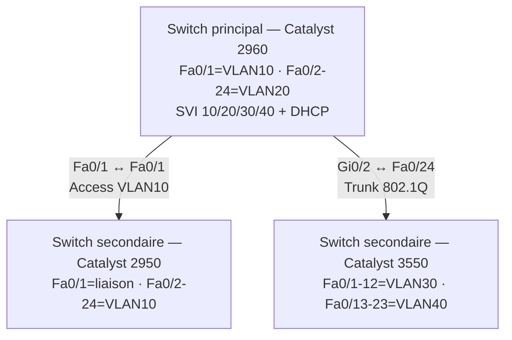
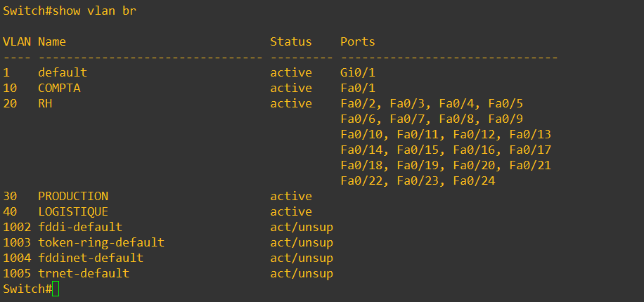
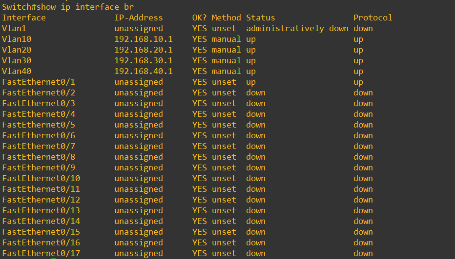
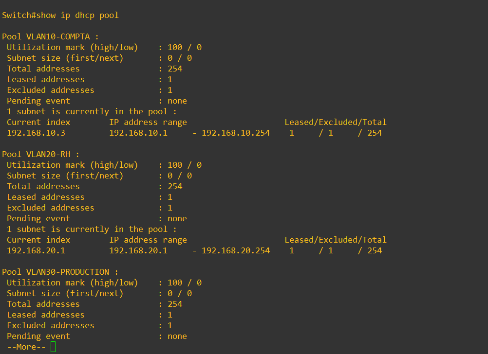
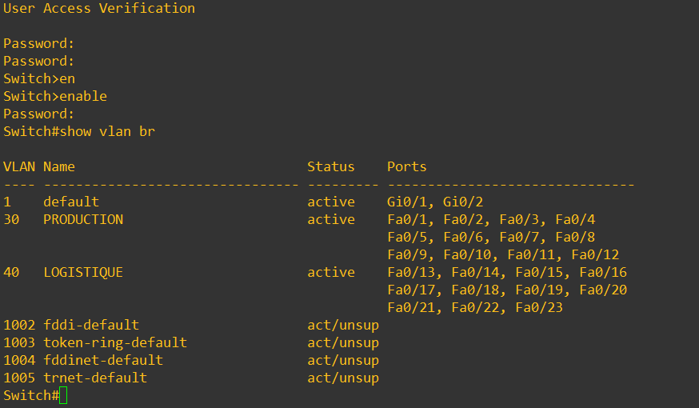
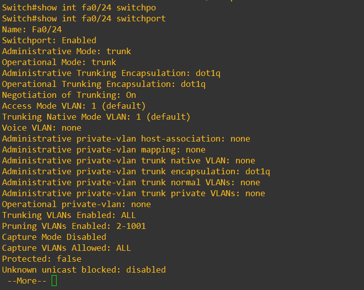
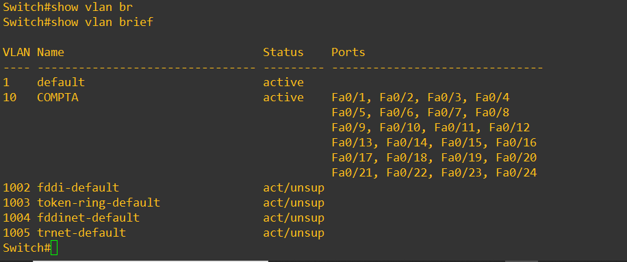
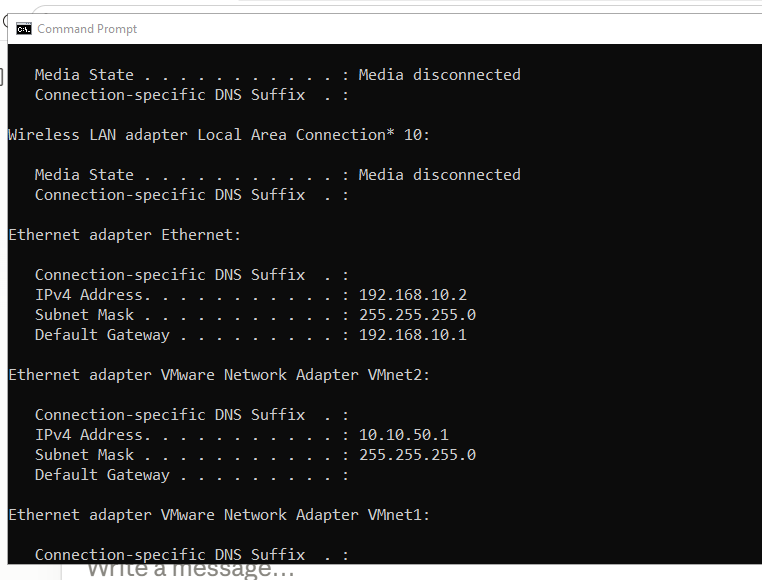

# Projet Réseau — Architecture 3 switches : VLAN, Trunking 802.1Q et DHCP centralisé



## 🎯 Objectif

Concevoir et déployer une architecture réseau à 3 switches Cisco réels,
avec 4 VLAN répartis sur plusieurs équipements, reliés par des liens trunk
802.1Q, et un serveur DHCP centralisé qui distribue automatiquement les
adresses IP à tous les VLAN — y compris ceux hébergés physiquement sur des
switches distants, à travers le trunk.

Ce projet simule une architecture d'entreprise réaliste : un switch
principal (cœur de réseau) et deux switches secondaires (extensions vers
d'autres zones/services), tous administrés depuis un point central.

## 🧰 Matériel utilisé

| Équipement | Rôle |
|------------|------|
| Cisco Catalyst 2960 (24 ports PoE) | Switch principal — cœur de réseau, serveur DHCP |
| Cisco Catalyst 3550 | Switch secondaire — extension VLAN 30/40 |
| Cisco Catalyst 2950 | Switch secondaire — extension VLAN 10 |
| Câble console RJ45 → USB | Accès CLI |
| PC Windows (x3, un par test) | Validation DHCP par VLAN |

## 🗺️ Topologie



## 🌐 Plan d'adressage

| VLAN | Nom | Réseau | Passerelle | Switch(es) porteur(s) |
|------|-----|--------|------------|------------------------|
| 10 | COMPTA | 192.168.10.0/24 | 192.168.10.1 | 2960 (Fa0/1) + 2950 (tous ports) |
| 20 | RH | 192.168.20.0/24 | 192.168.20.1 | 2960 (Fa0/2-24) |
| 30 | PRODUCTION | 192.168.30.0/24 | 192.168.30.1 | 3550 (Fa0/1-12) |
| 40 | LOGISTIQUE | 192.168.40.0/24 | 192.168.40.1 | 3550 (Fa0/13-23) |

Le serveur DHCP est centralisé sur le switch principal (2960) uniquement —
les switches secondaires n'hébergent aucun pool, ils ne font que relayer
le trafic à travers leurs ports et le trunk.

## ⚙️ Configuration — Switch principal (Catalyst 2960)

**VLAN et ports :**
```
vlan 10
 name COMPTA
vlan 20
 name RH
vlan 30
 name PRODUCTION
vlan 40
 name LOGISTIQUE

interface fastethernet 0/1
 switchport mode access
 switchport access vlan 10

interface range fastethernet 0/2 - 24
 switchport mode access
 switchport access vlan 20
```

**Trunk vers le 3550 :**
```
interface gigabitethernet 0/2
 switchport mode trunk
```

**Interfaces virtuelles (SVI) — passerelles de chaque VLAN :**
```
interface vlan 10
 ip address 192.168.10.1 255.255.255.0
 no shutdown
interface vlan 20
 ip address 192.168.20.1 255.255.255.0
 no shutdown
interface vlan 30
 ip address 192.168.30.1 255.255.255.0
 no shutdown
interface vlan 40
 ip address 192.168.40.1 255.255.255.0
 no shutdown
```

**Serveur DHCP centralisé (4 pools) :**
```
ip dhcp excluded-address 192.168.10.1
ip dhcp excluded-address 192.168.20.1
ip dhcp excluded-address 192.168.30.1
ip dhcp excluded-address 192.168.40.1

ip dhcp pool VLAN10-COMPTA
 network 192.168.10.0 255.255.255.0
 default-router 192.168.10.1

ip dhcp pool VLAN20-RH
 network 192.168.20.0 255.255.255.0
 default-router 192.168.20.1

ip dhcp pool VLAN30-PRODUCTION
 network 192.168.30.0 255.255.255.0
 default-router 192.168.30.1

ip dhcp pool VLAN40-LOGISTIQUE
 network 192.168.40.0 255.255.255.0
 default-router 192.168.40.1
```

**Vérifications :**


*Les 4 VLAN créés sur le switch principal, avec Fa0/1 en VLAN10 et Fa0/2-24 en VLAN20.*


*Les 4 SVI (Vlan10/20/30/40) en up/up — Vlan30 et Vlan40 montent uniquement grâce au trunk vers le 3550, sans port physique local.*


*Les 4 pools DHCP configurés, chacun avec son adresse de passerelle exclue.*

## ⚙️ Configuration — Switch secondaire (Catalyst 3550)

```
vlan 30
 name PRODUCTION
vlan 40
 name LOGISTIQUE

interface range fastethernet 0/1 - 12
 switchport mode access
 switchport access vlan 30

interface range fastethernet 0/13 - 23
 switchport mode access
 switchport access vlan 40

interface fastethernet 0/24
 switchport trunk encapsulation dot1q
 switchport mode trunk
```

**Vérifications :**


*VLAN 30 (PRODUCTION) et 40 (LOGISTIQUE) avec leurs ports respectifs sur le switch secondaire.*


*Confirmation du trunk 802.1Q forcé (Administrative Mode: trunk) sur le port de liaison vers le 2960.*

## ⚙️ Configuration — Switch secondaire (Catalyst 2950)

```
vlan 10
 name COMPTA

interface range fastethernet 0/1 - 24
 switchport mode access
 switchport access vlan 10
```

**Vérification :**


*Les 24 ports du switch d'extension tous rattachés au VLAN 10 (COMPTA).*

## 🐞 Incident rencontré et correction

**Symptôme :** après câblage initial du lien 2950 ↔ 2960, `show interfaces
status` indiquait Fa0/1 connecté côté 2950, mais Fa0/2 (VLAN 20) connecté
côté 2960 — incohérence entre les deux extrémités du même câble.

**Cause :** le câble avait été branché sur le mauvais port physique côté
2960 (Fa0/2, dans VLAN20/RH, au lieu de Fa0/1, dans VLAN10/COMPTA prévu
pour cette liaison).

**Correction :** débranchement et rebranchement du câble sur le port
Fa0/1 du 2960, confirmé ensuite par un `show interfaces status`
cohérent des deux côtés (Fa0/1 connected, VLAN10, sur les deux switches).

**Leçon retenue :** toujours vérifier `show interfaces status` des deux
côtés d'une liaison inter-switch après câblage, pas uniquement d'un
côté — un lien peut sembler fonctionner en apparence tout en étant
raccordé au mauvais VLAN.

## 🧪 Résultats des tests DHCP

| Poste testé | Switch de rattachement | VLAN | IP obtenue | Passerelle | Résultat |
|---|---|---|---|---|---|
| PC test 1 | 2960 (direct) | 20 (RH) | 192.168.20.2 | 192.168.20.1 | ✅ |
| PC test 2 | 3550 (via trunk) | 30 (PRODUCTION) | 192.168.30.2 | 192.168.30.1 | ✅ |
| PC test 3 | 3550 (via trunk) | 40 (LOGISTIQUE) | 192.168.40.2 | 192.168.40.1 | ✅ |
| PC test 4 | 2950 (via liaison access) | 10 (COMPTA) | 192.168.10.2 | 192.168.10.1 | ✅ |

Les 4 VLAN, répartis sur 3 switches physiques différents, reçoivent
correctement leur adressage IP depuis un unique serveur DHCP centralisé
sur le switch principal — validant l'ensemble de la chaîne : VLAN → trunk
802.1Q → relais DHCP inter-switch → attribution IP côté client.


*Capture du poste rattaché au VLAN 10 via le switch 2950, ayant reçu son IP par DHCP à travers toute la chaîne de switches.*

## 📚 Compétences démontrées

- Conception d'une architecture réseau multi-switch avec plan d'adressage structuré
- Segmentation VLAN répartie sur plusieurs équipements physiques
- Configuration de trunks 802.1Q forcés (bonne pratique vs négociation DTP automatique)
- Compréhension et exploitation des interfaces virtuelles (SVI) pour héberger un service (DHCP) sur des VLAN sans port physique local
- Déploiement d'un serveur DHCP Cisco IOS avec pools multiples et exclusions d'adresses
- Diagnostic et correction d'une erreur de câblage inter-switch par lecture croisée de `show interfaces status`
- Validation de bout en bout par tests réels sur postes physiques, sur chaque segment de la topologie

---
*Projet réalisé dans le cadre d'une formation pratique réseau — Bloc 3 : Switching (VLAN, Trunking) avec extension DHCP.*
