# Projet : Bases du routage (rôle du routeur, table de routage, premier lien routé)

## Contexte

Ce projet ouvre le bloc **Routage** de ma formation pratique en réseau, après le bloc Switching (VLAN, trunking, STP, Port Security, EtherChannel, DHCP). Il a été réalisé sur du **matériel réel**, sans simulateur.

Les images de ce dossier reproduisent les sorties console relevées lors de la pratique sur du matériel réel.

## Objectifs

- Comprendre ce qu'un routeur fait et qu'un switch de couche 2 ne fait pas.
- Identifier le matériel : modèle, version IOS, modules, interfaces.
- Lire une table de routage (`show ip route`) et comprendre les critères de choix d'une route.
- Configurer une première interface routée et observer l'apparition d'une route `C` (connectée).
- Observer la résolution ARP entre un PC et son routeur.
- Observer le comportement d'un routeur face à une destination sans route.
- Diagnostiquer un incident : un ping qui n'atteint pas le routeur.

## Matériel utilisé

| Équipement | Rôle |
|---|---|
| Routeur Cisco 1841 (IOS 12.4(24)T3, image ADVSECURITYK9) | Routeur testé |
| Carte HWIC-2FE (slot 1) | 2 ports FastEthernet supplémentaires, routés |
| Carte HWIC-1T (WIC 0) | 1 port série (non utilisé dans ce projet) |
| PC Windows | Machine cliente, cible des tests |
| Câble console RJ45 → USB | Accès à la console du routeur (PuTTY ou Tera Term, 9600 bauds) |
| Câble Ethernet droit | Liaison `Fa0/0` ↔ PC |

## Topologie

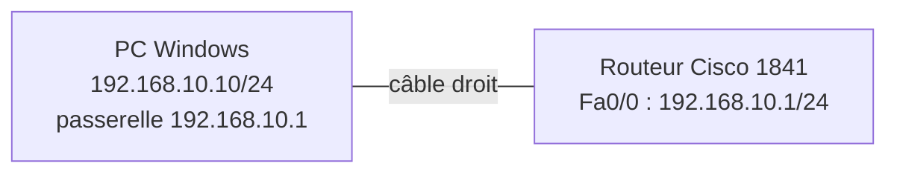

Réseau utilisé : `192.168.10.0/24`.

## Ordre de câblage

1. Câble console : port **Console** du 1841 vers un port USB du PC (via l'adaptateur RJ45 → USB).
2. Câble Ethernet droit : port **Fa0/0** du 1841 vers la carte réseau Ethernet du PC.

## Partie 1 : identifier le routeur

### Commandes tapées (sur le routeur 1841)

```
show version
show inventory
show ip interface brief
```

### Résultats

`show version` : modèle, version IOS et mémoire.

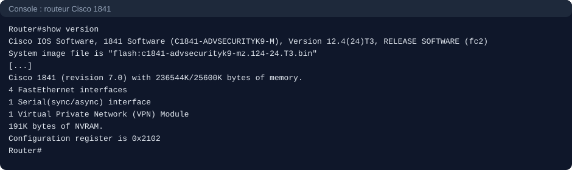

`show inventory` : les deux cartes installées, une carte série HWIC-1T et une carte HWIC-2FE.

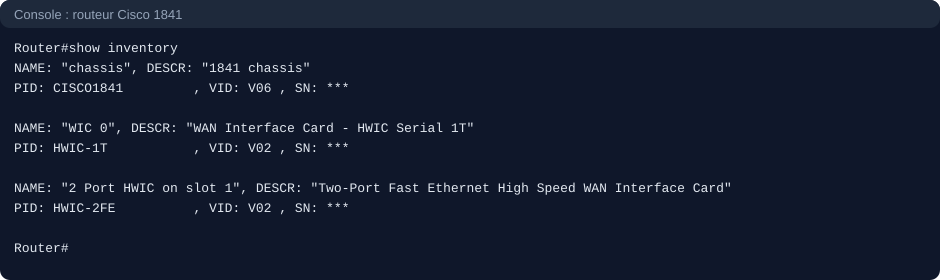

`show ip interface brief` : les interfaces sont toutes `administratively down`, ce qui est normal sur un routeur non configuré. Le 1841 dispose donc de 4 ports Ethernet routés (`Fa0/0`, `Fa0/1`, `Fa0/1/0`, `Fa0/1/1`) et d'un port série (`Serial0/0/0`).

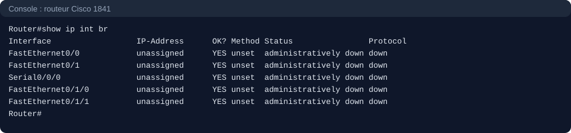

## Partie 2 : table de routage vide

### Commande tapée (sur le routeur 1841)

```
show ip route
```

### Résultat

Aucune route n'est présente, et `Gateway of last resort is not set`. Aucune interface n'a d'adresse IP et elles sont toutes désactivées.

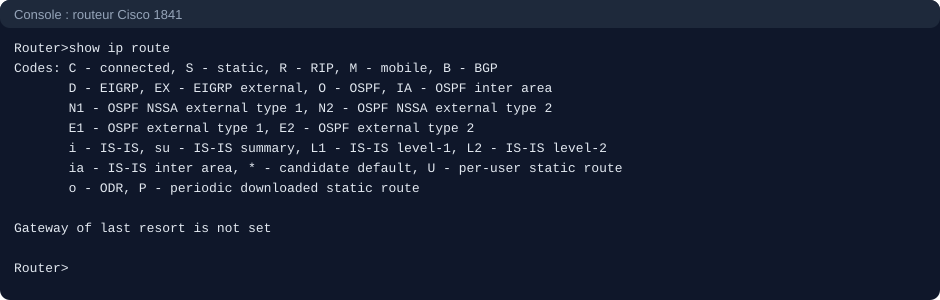

## Partie 3 : configurer la première interface

### Commandes tapées (sur le routeur 1841)

```
enable
configure terminal
interface fastEthernet 0/0
ip address 192.168.10.1 255.255.255.0
no shutdown
end
show ip route
```

### Résultat

Après `no shutdown`, les deux messages `changed state to up` confirment que le lien physique et la couche 2 sont opérationnels.

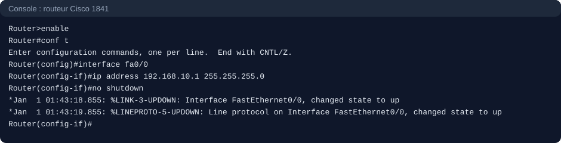

La table de routage contient maintenant la première route `C` : `192.168.10.0/24 is directly connected, FastEthernet0/0`. Une route `C` n'apparaît que si l'interface a une **adresse IP** et qu'elle est **up**.

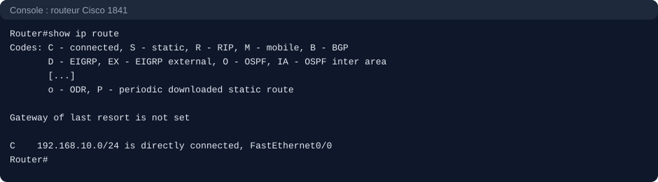

## Partie 4 : configurer le PC et tester

### Configuration du PC

Sur Windows : `Win + R`, `ncpa.cpl`, propriétés de la carte Ethernet, IPv4, adresse manuelle :

| Champ | Valeur |
|---|---|
| Adresse IP | 192.168.10.10 |
| Masque | 255.255.255.0 |
| Passerelle | 192.168.10.1 |

### Commandes tapées (sur le PC, dans Git Bash)

```
ipconfig
ping 192.168.10.1
arp -a
```

### Commande tapée (sur le routeur 1841)

```
show ip arp
```

### Résultats

Configuration IP du PC :

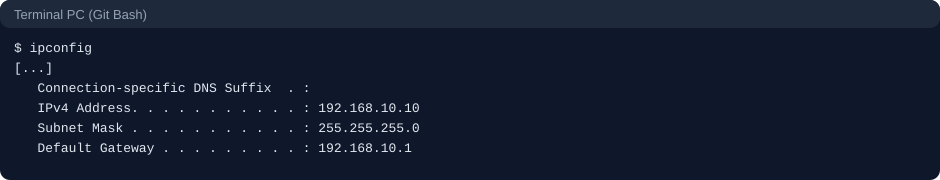

Ping vers le routeur : 4 réponses sur 4, 0 % de perte. Le `TTL=255` est la valeur de départ des paquets générés par un routeur Cisco (Windows démarre à 128, Linux à 64), ce qui indique que la réponse vient d'un équipement Cisco.

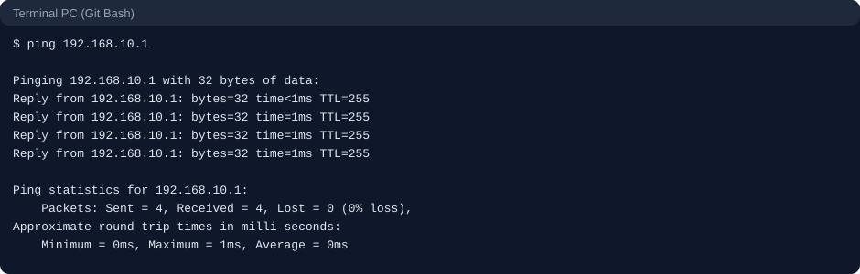

Table ARP du routeur : l'adresse `192.168.10.1` (le routeur lui-même, âge `-`) et l'adresse `192.168.10.10` (le PC, apprise via ARP).

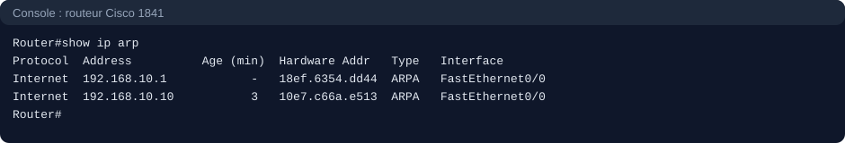

Table ARP du PC : la MAC de la passerelle `192.168.10.1` est `18-ef-63-54-dd-44`, la même que celle de `Fa0/0` côté routeur (`18ef.6354.dd44`). Seul le format change : tirets sous Windows, points sous Cisco.

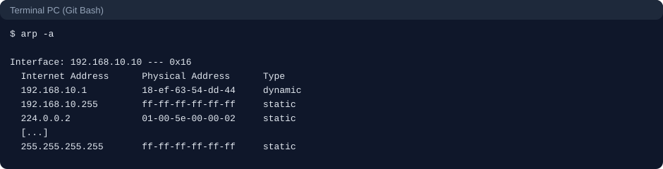

## Partie 5 : destination sans route, et incident rencontré

### Test

Ping vers `192.168.20.1`, un réseau absent de la table de routage du 1841.

### Incident : le ping n'atteint pas le routeur

**Symptôme.** Le ping vers `192.168.20.1` affiche `Request timed out` quatre fois, alors que la théorie prévoyait un message `Destination host unreachable` venant du routeur.

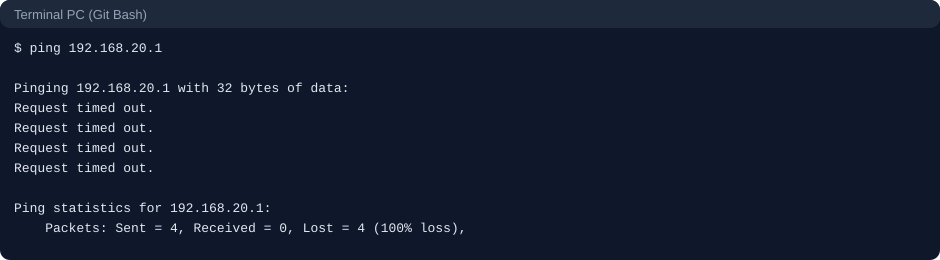

**Diagnostic.** Un `tracert` montre que le premier saut est `192.168.18.1` et non `192.168.10.1` : le paquet n'est jamais arrivé au 1841, il est parti par une autre carte réseau (la carte Wi-Fi du PC). Un timeout seul ne prouve donc rien sur le comportement du routeur.

```
tracert -d 192.168.20.1
```

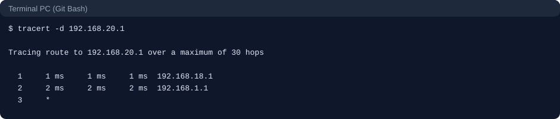

**Cause probable.** Le PC possède sa propre table de routage et dispose de deux chemins par défaut (Ethernet et Wi-Fi). Il a utilisé le Wi-Fi. Le comportement a changé dès la désactivation du Wi-Fi, ce qui confirme que le paquet partait bien par cette carte.

**Correction.** Désactiver la carte Wi-Fi du PC pendant les tests, puis relancer le ping.

### Résultat après correction

La réponse vient de `192.168.10.1` (le routeur) : `Destination host unreachable`. Le 1841 a reçu le paquet, n'a trouvé aucune route pour `192.168.20.0/24`, l'a jeté et a renvoyé un message ICMP « destination unreachable ».

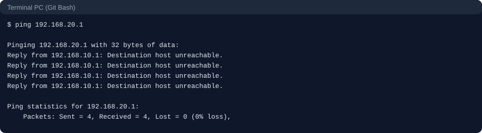

**Point de lecture.** Les statistiques affichent `Received = 4, Lost = 0`, ce qui pourrait faire croire à un succès. Ce sont en réalité les 4 messages d'erreur du routeur, pas des réponses de la destination. Il faut lire le contenu des lignes `Reply from`, pas seulement les statistiques.

## Résumé des tests

| Test | Résultat attendu | Résultat obtenu |
|---|---|---|
| Table de routage avant configuration | Vide | Vide |
| Route `C` après `ip address` + `no shutdown` | `192.168.10.0/24` connectée | Conforme |
| Ping PC vers routeur | Réponses | 4/4, TTL 255 |
| Cohérence ARP routeur / PC | MAC identiques | Identiques |
| Ping vers un réseau sans route (Wi-Fi actif) | `Destination host unreachable` | Timeout : incident, voir partie 5 |
| Ping vers un réseau sans route (Wi-Fi coupé) | `Destination host unreachable` du routeur | Conforme |

## Ce que j'ai retenu

- **Routeur et switch** : le routeur décide avec l'IP (couche 3), le switch avec la MAC (couche 2). Le routeur sépare les domaines de broadcast.
- **Ordre de choix d'une route** : 1. préfixe le plus long, 2. distance administrative la plus petite, 3. métrique la plus petite.
- **Distances administratives par défaut** : connecté 0, statique 1, EIGRP 90, OSPF 110, RIP 120.
- **Route connectée** : elle n'apparaît que si l'interface a une adresse IP et est `up`.
- **Sans route**, le paquet est jeté et le routeur renvoie en général un message ICMP « destination unreachable ».

## Compétences démontrées

- Identification d'un équipement Cisco (`show version`, `show inventory`, `show ip interface brief`).
- Configuration d'une interface routée et lecture de la table de routage.
- Lecture et recoupement des tables ARP du routeur et du PC.
- Interprétation d'un message ICMP et d'un `TTL`.
- Diagnostic méthodique d'un incident avec `ping` et `tracert`, en vérifiant d'abord que le paquet emprunte le bon chemin.

## Remise en état après les tests

- Remettre la carte Ethernet du PC en **Obtenir une adresse IP automatiquement**.
- Réactiver la carte Wi-Fi du PC.
