# Projet : routage inter-VLAN (router-on-a-stick)

## Contexte

Deux VLAN sont des réseaux IP distincts : sans routeur, les machines de l'un ne peuvent pas joindre celles de l'autre. Ce projet met en place le routage inter-VLAN avec la méthode **router-on-a-stick** : un seul lien trunk 802.1Q entre un switch et un routeur, avec une sous-interface par VLAN sur le routeur.

Les images reproduisent les sorties console relevées lors de la pratique sur du matériel réel. Les photos (câblage, pings et tracert de PC-B) sont de vraies captures.

## Objectifs

- Créer deux VLAN sur un switch et leur affecter des ports access.
- Configurer un trunk 802.1Q vers un routeur.
- Créer deux sous-interfaces sur le routeur, chacune servant de passerelle à son VLAN.
- Prouver la communication entre VLAN par ping, table ARP, table de routage et tracert.
- Diagnostiquer un incident (pare-feu Windows) du bas vers le haut.

## Matériel

| Équipement | Rôle |
|---|---|
| Switch Cisco Catalyst 2960 (SW-2960) | VLAN, ports access, trunk |
| Routeur Cisco 1841 (R1-1841), IOS 12.4(24)T3 | Routage inter-VLAN |
| PC-A (PC avec Git Bash) | Machine du VLAN 10 |
| PC-B (portable Dell) | Machine du VLAN 20 |
| Câble console RJ45 vers USB, câbles Ethernet droits | Configuration et liaisons |

## Plan d'adressage

| VLAN | Nom | Réseau | Passerelle (routeur) | Machine |
|---|---|---|---|---|
| 10 | COMPTA | 192.168.10.0/24 | 192.168.10.1 (Fa0/0.10) | PC-A : 192.168.10.10 |
| 20 | RH | 192.168.20.0/24 | 192.168.20.1 (Fa0/0.20) | PC-B : 192.168.20.10 |

## Topologie

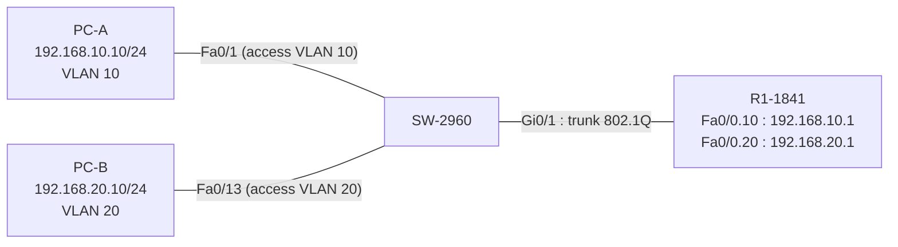

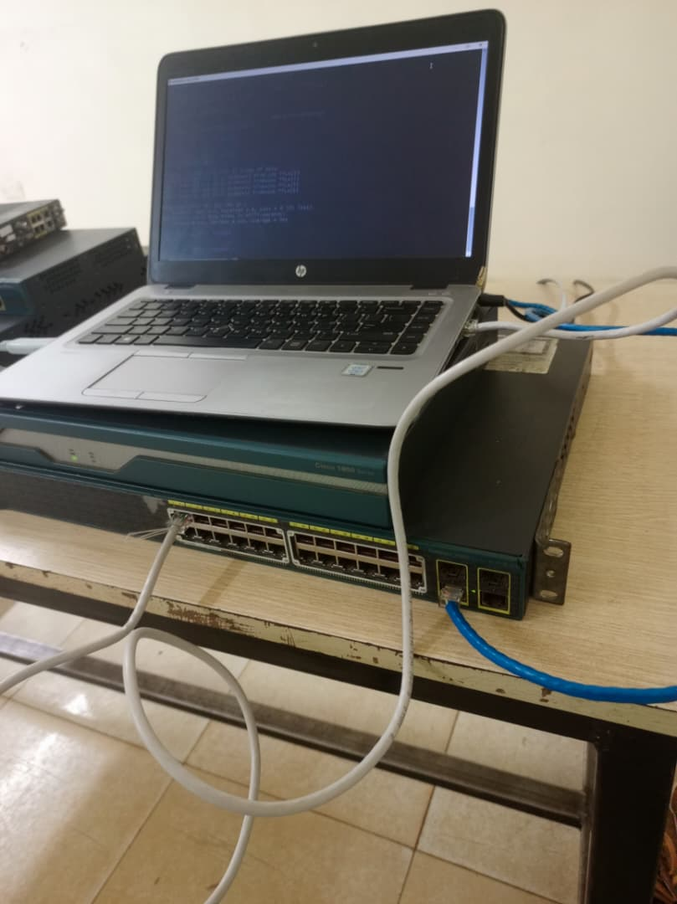

## Ordre de câblage

1. Câble console sur le 2960, puis sur le 1841 selon l'équipement configuré.
2. Câble droit entre **Gi0/1 du 2960** et **Fa0/0 du 1841** (trunk).
3. PC-A sur **Fa0/1** du 2960.
4. PC-B sur **Fa0/13** du 2960.
5. Wi-Fi coupé sur les deux PC pendant tous les tests.

## Commandes tapées

Remarque : les commandes d'affectation des ports (2960) et de l'interface physique Fa0/0 (1841) sont données sous leur forme standard. Leur effet est prouvé par les sorties des commandes `show` plus bas.

### Sur le switch 2960

```
hostname SW-2960
vlan 10
 name COMPTA
 exit
vlan 20
 name RH
 exit
interface range fa0/1 - 12
 switchport mode access
 switchport access vlan 10
 exit
interface range fa0/13 - 24
 switchport mode access
 switchport access vlan 20
 exit
interface gi0/1
 switchport mode trunk
 description TRUNK-VERS-1841
 end
show vlan brief
show running-config interface fa0/1
show interfaces fa0/24 switchport
show running-config interface fa0/13
show interfaces gi0/1 switchport
show interfaces trunk
show interfaces fa0/13 status
write memory
```

### Sur le routeur 1841

```
configure terminal
hostname R1-1841
interface fa0/0
 no ip address
 no shutdown
 exit
interface fa0/0.10
 description GW-VLAN10-COMPTA
 encapsulation dot1Q 10
 ip address 192.168.10.1 255.255.255.0
 exit
interface fa0/0.20
 description GW-VLAN20-RH
 encapsulation dot1Q 20
 ip address 192.168.20.1 255.255.255.0
 end
show ip interface brief
show ip arp
ping 192.168.10.10
show ip route
write memory
show startup-config | include hostname
```

`GW` signifie *gateway* (passerelle) : c'est seulement une description lisible de la sous-interface.

### Sur PC-A (invite de commandes en administrateur, pour l'incident)

```
netsh advfirewall firewall add rule name="ICMP-TEST" protocol=icmpv4:8,any dir=in action=allow
```

### Tests sur PC-A et PC-B

```
ipconfig
ping 192.168.10.1          (PC-A)
ping 192.168.20.1          (PC-B)
ping 192.168.10.10         (depuis PC-B)
ping 192.168.20.1          (depuis PC-A)
ping 192.168.20.10         (depuis PC-A)
tracert 192.168.20.10      (depuis PC-A)
tracert 192.168.10.10      (depuis PC-B)
```

## Configuration du switch

### VLAN et ports access

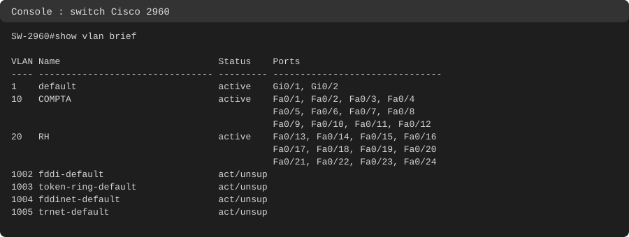

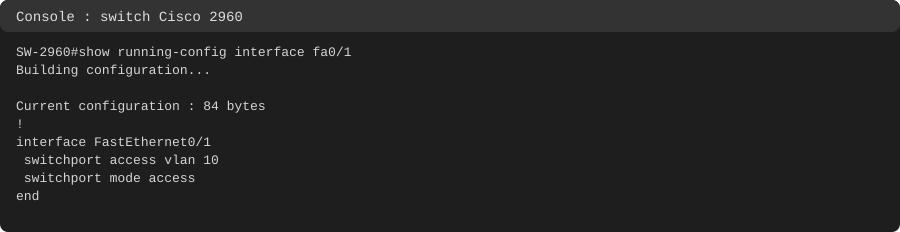

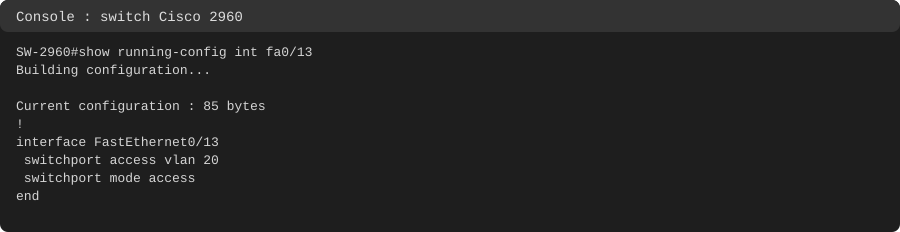

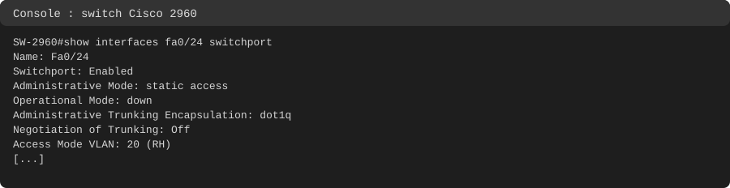

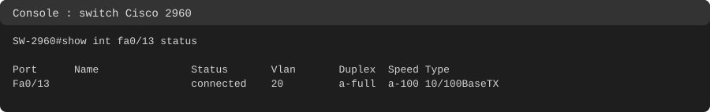

### Trunk vers le routeur

Gi0/1 a été choisi comme port trunk : il est libre, en RJ45, et laisse Fa0/24 dans le VLAN 20.

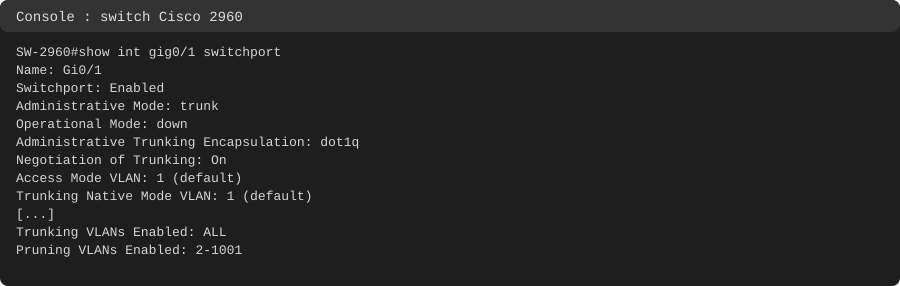

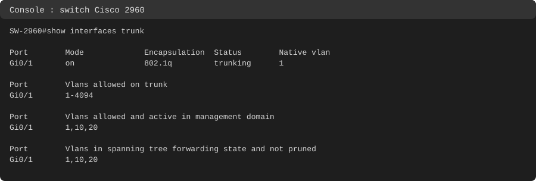

## Configuration du routeur

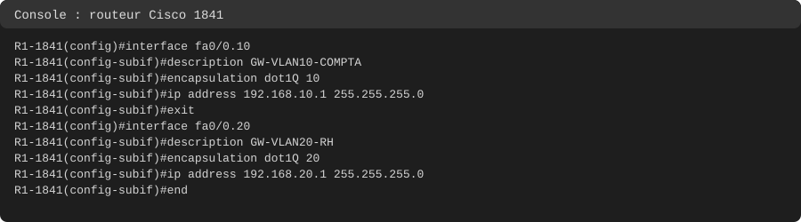

Avant le branchement du câble, la couche 1 est down :

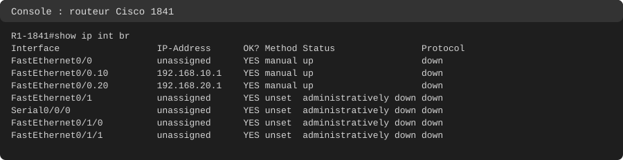

Après le branchement, tout passe en up/up :

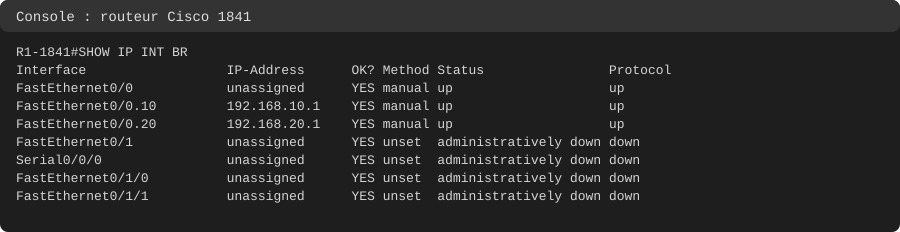

## Tests

### Ping vers la passerelle

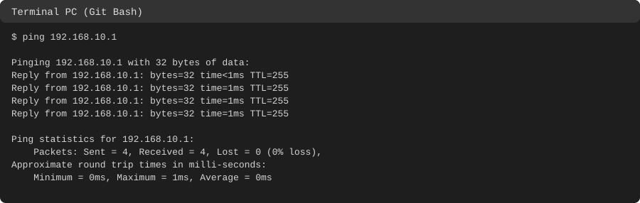

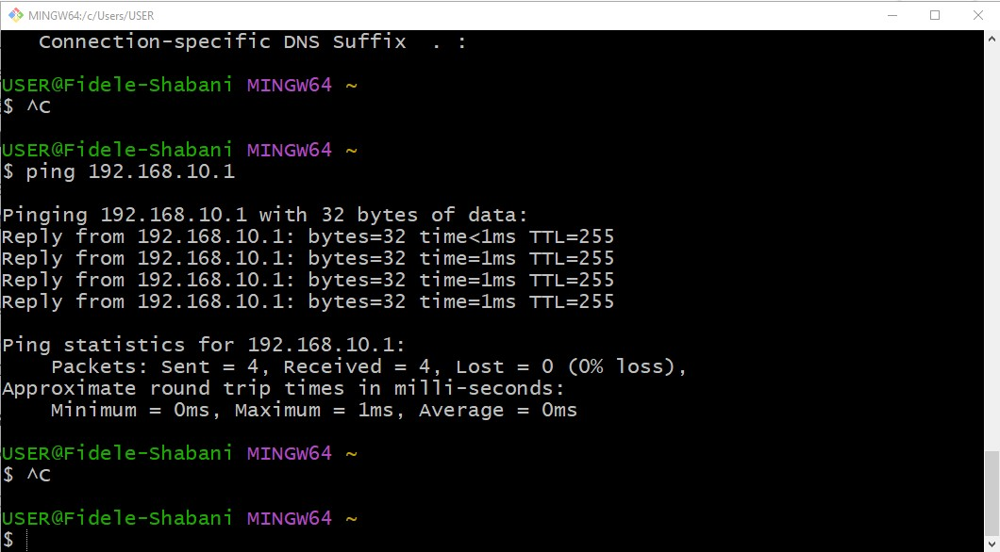

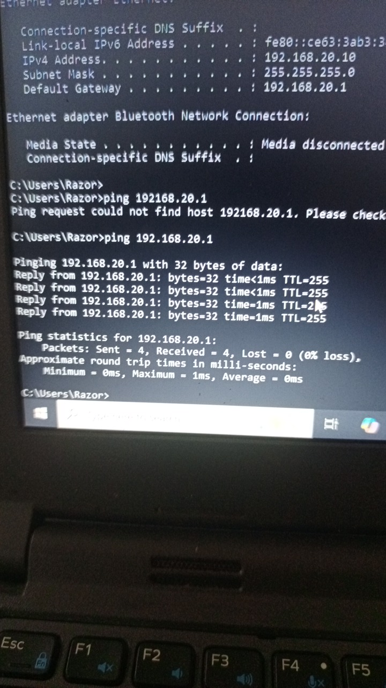

### Configuration IP de PC-A et PC-B

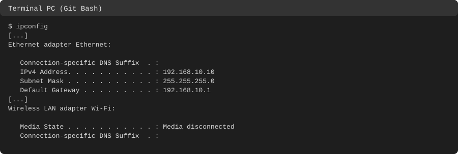

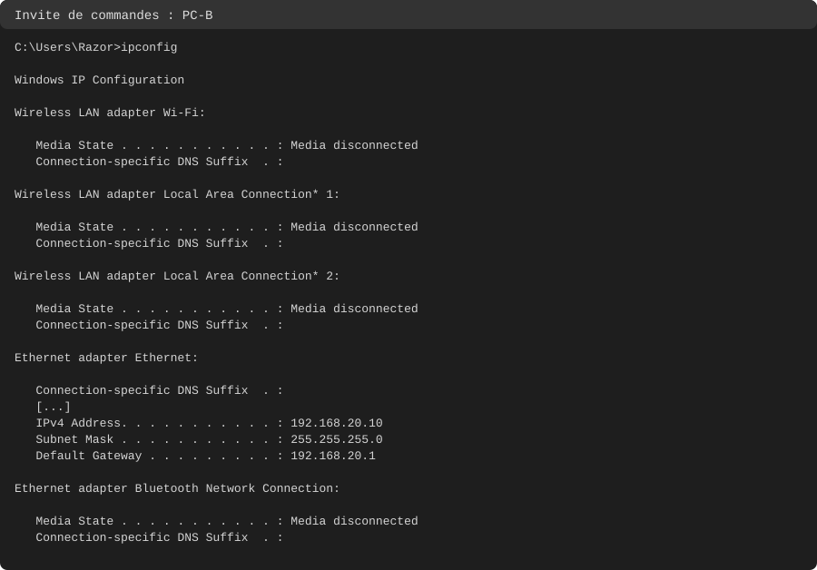

### Table ARP, ping du routeur et table de routage

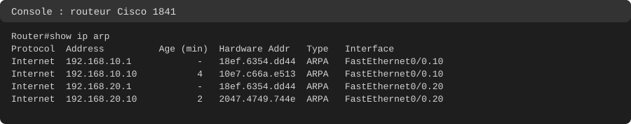

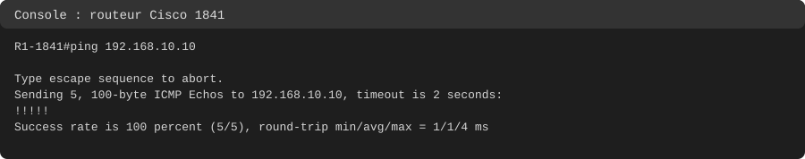


### Ping entre VLAN et tracert

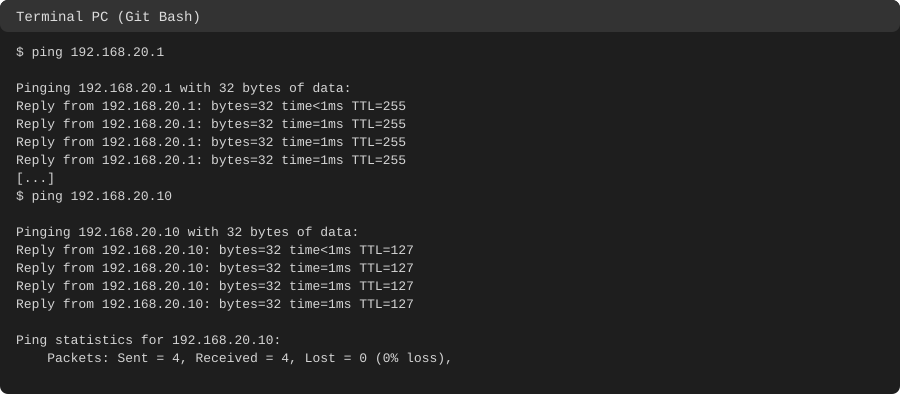

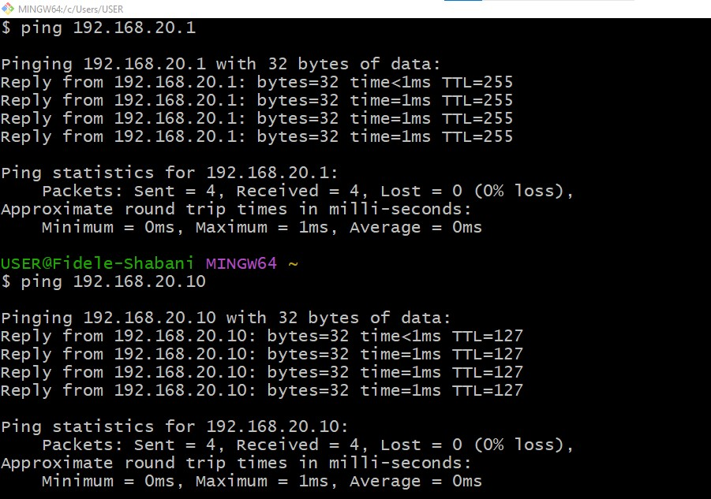

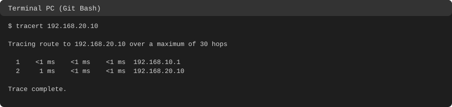

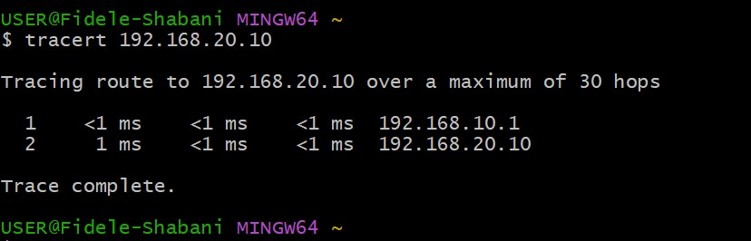

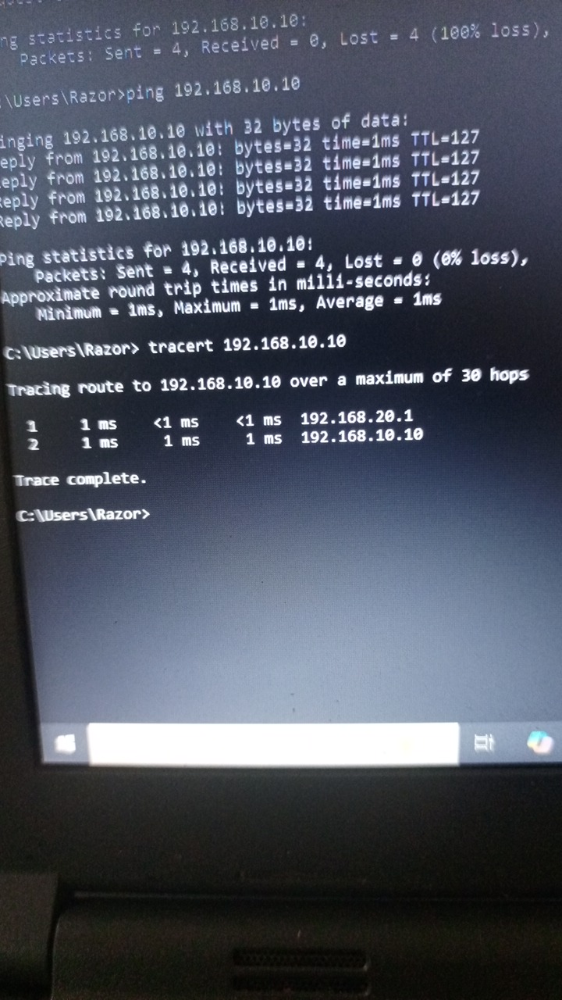

### Tableau des tests

| Test | Depuis | Vers | Résultat | Lecture |
|---|---|---|---|---|
| Ping passerelle | PC-A | 192.168.10.1 | 4/4, TTL 255 | Le routeur répond lui-même |
| Ping passerelle | PC-B | 192.168.20.1 | 4/4, TTL 255 | Le routeur répond lui-même |
| Ping entre VLAN, avant la règle | PC-B | 192.168.10.10 | 0/4, timeout | Bloqué par le pare-feu de PC-A |
| Ping entre VLAN, après la règle | PC-B | 192.168.10.10 | 4/4, TTL 127 | 128 moins 1 saut de routeur |
| Ping depuis le routeur | R1-1841 | 192.168.10.10 | 5/5 | PC-A répond dans son propre réseau |
| Ping vers l'autre passerelle | PC-A | 192.168.20.1 | 4/4, TTL 255 | Routeur atteint via la passerelle |
| Ping entre VLAN | PC-A | 192.168.20.10 | 4/4, TTL 127 | Routage dans le sens inverse |
| Tracert | PC-A | 192.168.20.10 | 2 sauts : 192.168.10.1 puis 192.168.20.10 | Un seul routeur sur le chemin |
| Tracert | PC-B | 192.168.10.10 | 2 sauts : 192.168.20.1 puis 192.168.10.10 | Chemin symétrique |
| Table ARP du routeur | R1-1841 | | Les deux PC sur Fa0/0.10 et Fa0/0.20 | Couche 2 correcte |
| Table de routage | R1-1841 | | 2 routes C, aucune route statique | Les routes connectées suffisent |

La même adresse MAC (18ef.6354.dd44) apparaît pour 192.168.10.1 et 192.168.20.1 : c'est l'interface physique Fa0/0 qui porte les deux sous-interfaces.

## Incidents rencontrés et corrigés

### 1. Le routeur est revenu vierge après redémarrage

Le 1841 avait été éteint sans `write memory` : la configuration précédente a disparu au démarrage. Le routeur a été reconfiguré de zéro. Leçon : sauvegarder dès qu'une configuration est validée.

### 2. Ping entre VLAN en timeout (pare-feu Windows de PC-A)

- **Symptôme** : le ping de PC-B vers PC-A donne 4 timeouts.
- **Diagnostic, du bas vers le haut** :
  - `show ip arp` sur le routeur : les deux PC y figurent avec leur MAC, les couches 1 et 2 fonctionnent et le paquet a bien atteint le VLAN 10.
  - Le ping du routeur vers PC-A réussit (5/5), car la demande vient du même sous-réseau.
  - Hypothèse : le pare-feu de PC-A bloque l'ICMP venant d'un autre sous-réseau.
- **Correction** : règle `ICMP-TEST` autorisant l'écho ICMPv4 entrant sur PC-A.
- **Preuve** : le ping suivant donne 4/4 avec TTL 127. Seule la règle a changé entre les deux essais.

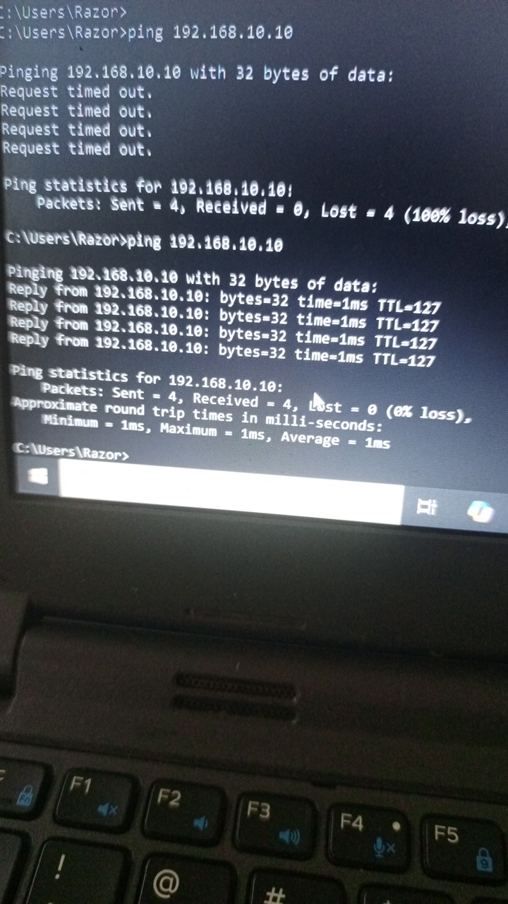

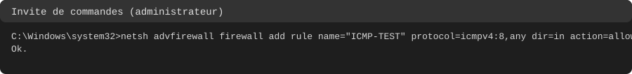

### 3. Erreur de frappe sur l'adresse

Un premier ping de PC-B a été tapé `192168.20.1` (sans le point) : « could not find host ». L'erreur venait du PC, pas du réseau, et a été corrigée immédiatement.

### Remarque sur le trunk

Le statut `Not Present` affiché par `show interfaces gi0/1 status` ne signifie pas forcément un emplacement SFP : il apparaît aussi quand aucun câble n'est branché. Le port était bien en RJ45.

## Sauvegarde

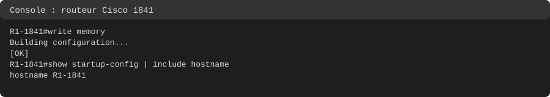

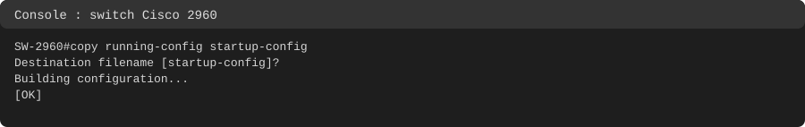

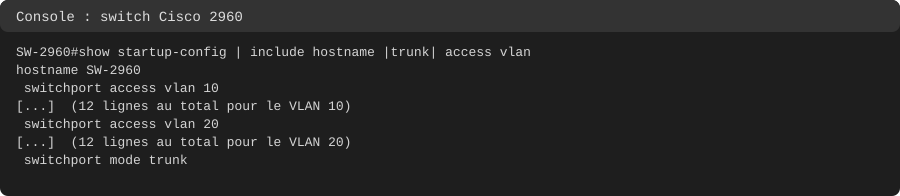

Les VLAN sont enregistrés dans `vlan.dat`, pas dans la startup-config.

## Ce que j'ai retenu

- Un VLAN est un réseau IP : pour les relier il faut un routeur.
- La passerelle d'un PC doit être dans son propre VLAN, car l'ARP est un broadcast qui ne sort pas du VLAN.
- Router-on-a-stick : trunk 802.1Q, une sous-interface par VLAN (`encapsulation dot1Q N` avant l'IP), interface physique sans adresse.
- Un paquet entre deux VLAN traverse le trunk deux fois (tag 10 puis tag 20). Limite : un seul câble partagé.
- Les routes `C` apparaissent seules dès qu'une interface est up/up avec une IP : elles suffisent ici.
- TTL 255 = le routeur répond lui-même ; TTL 127 = le paquet a traversé un routeur.
- Lire l'origine de chaque ligne et dépanner du bas vers le haut ; prouver une réparation par un test.
- Un switch de couche 2 n'apparaît pas dans un tracert.

## Compétences démontrées

- Création de VLAN et configuration de ports access et trunk 802.1Q.
- Configuration de sous-interfaces sur un routeur Cisco.
- Vérification par `show vlan`, `show interfaces trunk`, `show ip arp`, `show ip route`.
- Utilisation de ping et tracert, lecture du TTL.
- Diagnostic méthodique d'un incident (couche 1, 2, puis 3 et pare-feu hôte).
- Sauvegarde de configuration et vérification de la startup-config.
- Documentation d'un projet réalisé sur du matériel réel.

## Remise en état

Sur PC-A (invite de commandes en administrateur) :

```
netsh advfirewall firewall delete rule name="ICMP-TEST"
```

Sur les PC : remettre la carte Ethernet en IP automatique et réactiver le Wi-Fi.

Sur le 1841 :

```
write erase
reload
```

Sur le 2960 :

```
write erase
delete vlan.dat
reload
```
