# Projet : routage inter-VLAN avec SVI sur un switch multilayer (Cisco 3550)

## Contexte

Dans le projet précédent (`projet-routage-inter-vlan`), le routage entre VLAN était fait par un routeur externe (router-on-a-stick) : un trunk 802.1Q et une sous-interface par VLAN. Ce projet refait la même chose, mais **à l'intérieur d'un switch multilayer** : chaque VLAN reçoit une interface virtuelle de couche 3 appelée **SVI** (*Switch Virtual Interface*), qui sert de passerelle à son VLAN. Il n'y a plus ni trunk, ni routeur, ni sous-interface.

Les images reproduisent les sorties console relevées lors de la pratique sur du matériel réel. Les photos et captures d'écran (câblage, pings, tracert, table MAC) sont de vraies captures.

## Objectifs

- Identifier un switch de niveau 3 (`show version`) et vérifier son état initial.
- Créer deux VLAN et affecter des ports access.
- Activer le routage sur le switch (`ip routing`) et créer deux SVI.
- Prouver le routage entre VLAN par ping, table de routage, tracert et table MAC.
- Diagnostiquer et documenter un incident ponctuel côté PC.
- Comparer cette méthode avec le router-on-a-stick.

## Matériel

| Équipement | Rôle |
|---|---|
| Switch Cisco Catalyst 3550 (SW-3550), modèle WS-C3550-24-SMI, IOS 12.1(14)EA1a | VLAN, SVI, routage |
| PC-A (PC avec Git Bash) | Machine du VLAN 10 |
| PC-B (portable Dell) | Machine du VLAN 20 |
| Câble console RJ45 vers USB, câbles Ethernet droits | Configuration et liaisons |

Le routeur 1841 du projet précédent est **éteint** pendant toute la pratique : sa configuration sauvegardée utilise les mêmes adresses 192.168.10.1 et 192.168.20.1 que les SVI, et le rallumer sur ce réseau créerait un conflit d'adresses.

## Plan d'adressage

| VLAN | Nom | Réseau | Passerelle (SVI) | Machine |
|---|---|---|---|---|
| 10 | COMPTA | 192.168.10.0/24 | 192.168.10.1 (Vlan10) | PC-A : 192.168.10.10 |
| 20 | RH | 192.168.20.0/24 | 192.168.20.1 (Vlan20) | PC-B : 192.168.20.10 |

## Topologie

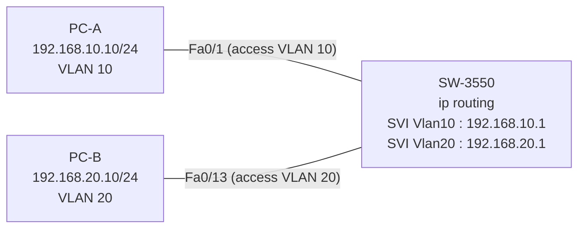

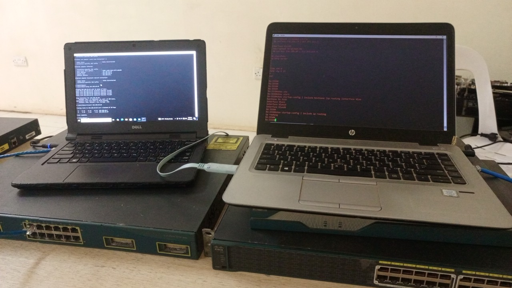

## Ordre de câblage

1. Câble console sur le 3550 (9600 bauds).
2. PC-A sur **Fa0/1** du 3550.
3. PC-B sur **Fa0/13** du 3550.
4. Wi-Fi coupé sur les deux PC pendant tous les tests.
5. Routeur 1841 éteint.

Aucun trunk n'est nécessaire : un câble par PC suffit.

## Identification du switch et état initial

`show version` indique `Running Layer2/3 Switching Image` : ce switch sait router. Les numéros de série sont masqués (`***`) sur l'image.

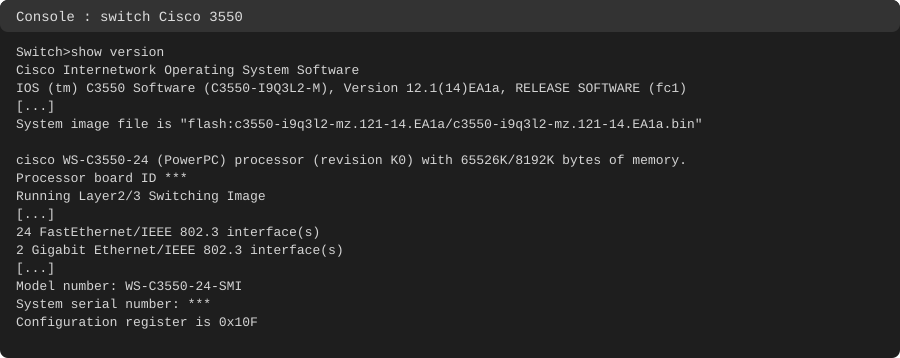

Avant toute configuration, seul le VLAN 1 existe et tous les ports y sont :

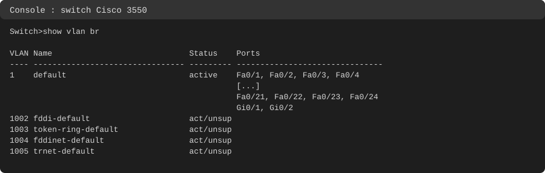

Le nom est `Switch`, il n'y a pas de `ip routing` ni de SVI autre que `Vlan1` :

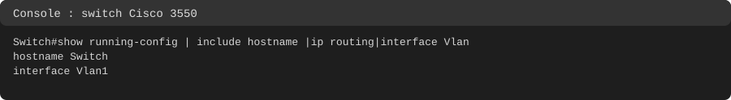

## Commandes tapées (sur le switch 3550)

Remarque : les commandes d'affectation des ports Fa0/1 et Fa0/13 sont données sous leur forme standard. Leur effet est prouvé par les sorties des commandes `show` plus bas.

```
enable
show vlan brief
show running-config | include hostname|ip routing|interface Vlan
configure terminal
hostname SW-3550
vlan 10
 name COMPTA
 exit
vlan 20
 name RH
 exit
end
show vlan brief
configure terminal
interface fa0/1
 switchport mode access
 switchport access vlan 10
 exit
interface fa0/13
 switchport mode access
 switchport access vlan 20
 end
show vlan brief
show running-config interface fa0/1
show running-config interface fa0/13
configure terminal
ip routing
interface vlan 10
 description GW-VLAN10-COMPTA
 ip address 192.168.10.1 255.255.255.0
 no shutdown
 exit
interface vlan 20
 description GW-VLAN20-RH
 ip address 192.168.20.1 255.255.255.0
 no shutdown
 end
show ip interface brief
show ip interface brief | include Vlan
show ip route
show mac-address-table dynamic
write memory
show startup-config | include ip routing
```

`GW` signifie *gateway* (passerelle) : c'est seulement une description lisible de l'interface.

## Configuration

### VLAN

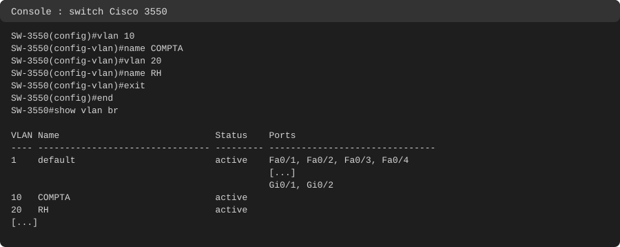

### Ports access

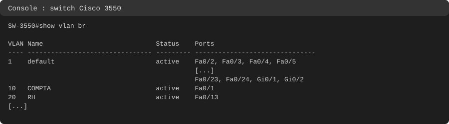

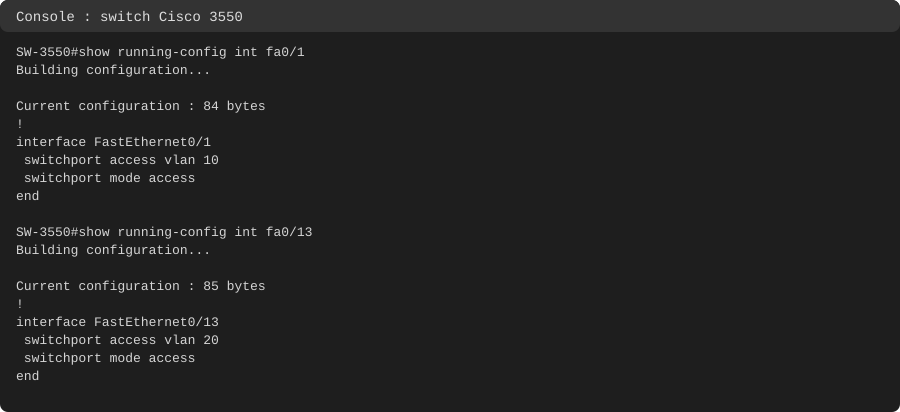

### Routage et SVI

`ip routing` est **désactivé par défaut** sur un switch multilayer. Sans lui, le 3550 se comporte comme un switch de couche 2, même avec des SVI configurées. Une SVI n'a pas de commande `encapsulation` : elle est rattachée à son VLAN à l'intérieur du switch.

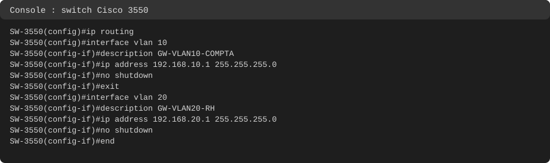

Avant le branchement des PC, les SVI sont `up` mais le protocole est `down` : aucun port actif n'appartient encore à ces VLAN.

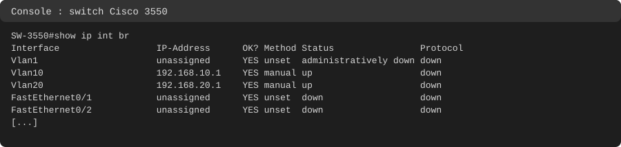

Après le branchement, les deux SVI passent en `up/up` :

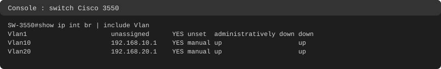

## Tests

### Table de routage

Les deux routes `C` sont apparues seules, sans aucune commande `ip route`, dès que chaque SVI est `up/up` avec une IP. Leur présence prouve aussi que `ip routing` est actif.

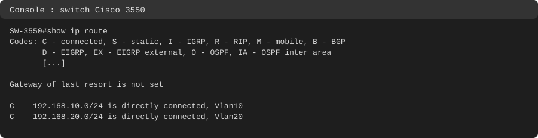

### Ping vers la passerelle

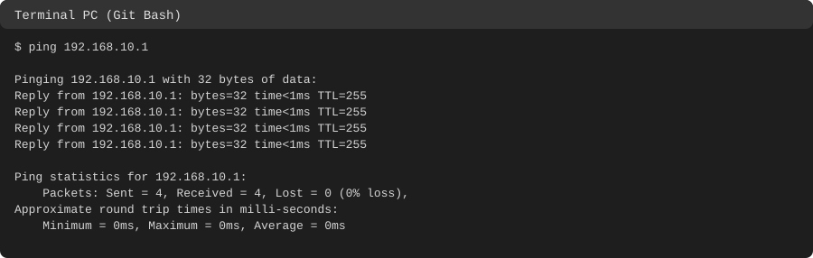

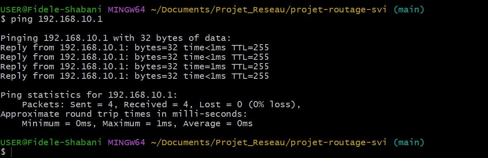

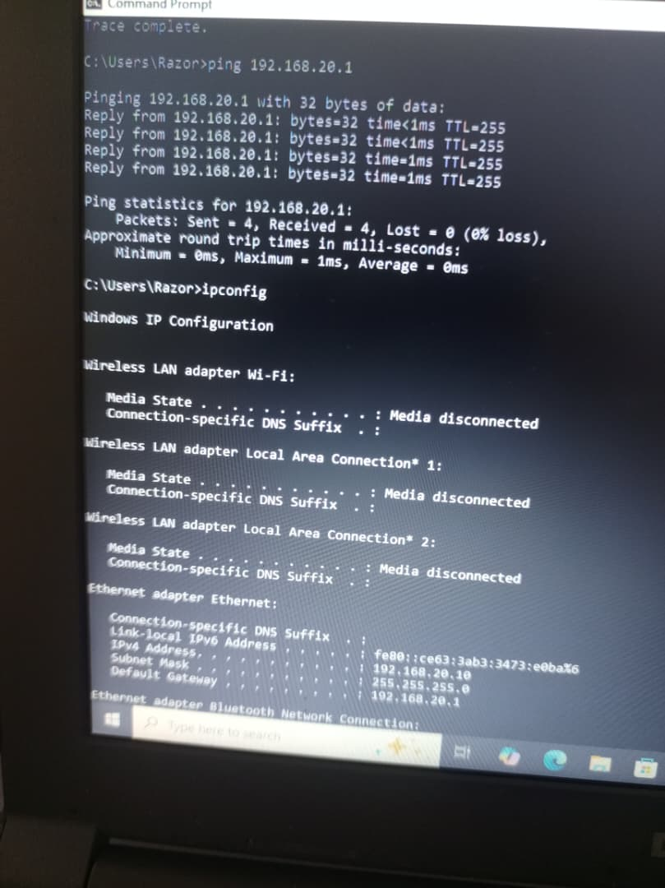

### Ping entre VLAN

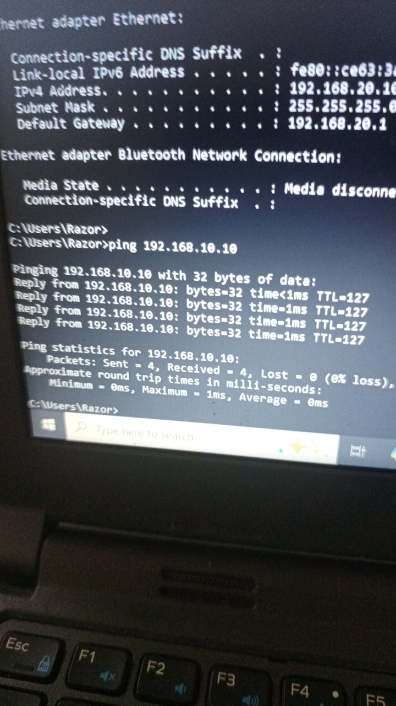

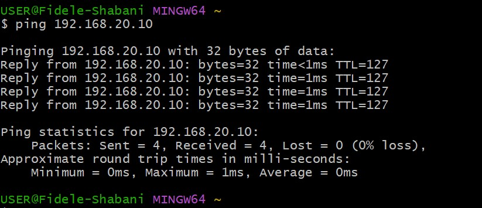

### Tracert

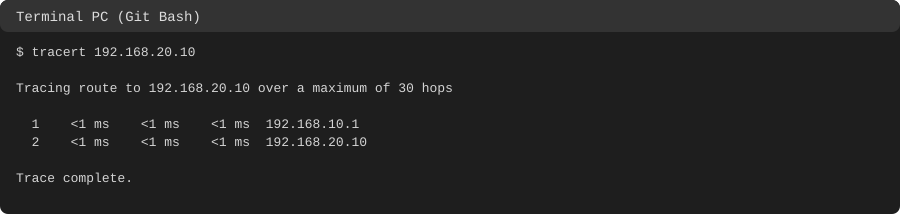

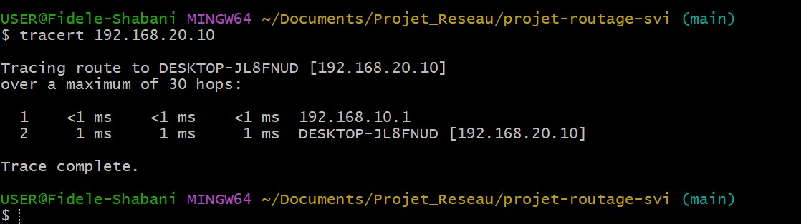

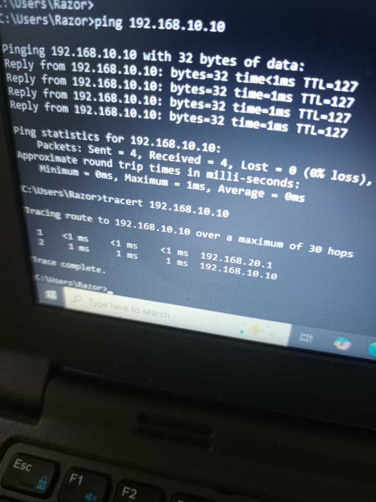

### Table MAC

La table MAC du switch prouve sur quels ports sont réellement les deux PC, et qu'aucun autre équipement n'est visible (le routeur 1841 est bien hors réseau).

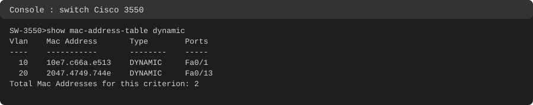

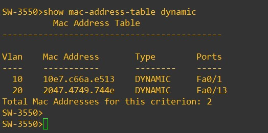

### Tableau des tests

| Test | Depuis | Vers | Résultat | Lecture |
|---|---|---|---|---|
| Ping passerelle | PC-A | 192.168.10.1 | 4/4, TTL 255 | Le switch répond lui-même via Vlan10 |
| Ping passerelle | PC-B | 192.168.20.1 | 4/4, TTL 255 | Le switch répond lui-même via Vlan20 |
| Ping entre VLAN | PC-B | 192.168.10.10 | 4/4, TTL 127 | 128 moins 1 saut de routage |
| Ping entre VLAN, premier essai | PC-A | 192.168.20.10 | 3 réponses réelles sur 4 (voir incident) | Un paquet est parti par la mauvaise carte |
| Ping entre VLAN, deuxième essai | PC-A | 192.168.20.10 | 4/4, TTL 127 | Routage dans le sens inverse |
| Tracert | PC-A | 192.168.20.10 | 2 sauts : 192.168.10.1 puis 192.168.20.10 | Un seul équipement de routage : le switch |
| Tracert | PC-B | 192.168.10.10 | 2 sauts : 192.168.20.1 puis 192.168.10.10 | Chemin symétrique |
| Table de routage | SW-3550 | | 2 routes C, aucune route statique | Les routes connectées suffisent |
| Table MAC | SW-3550 | | PC-A sur Fa0/1 (VLAN 10), PC-B sur Fa0/13 (VLAN 20) | Position des PC prouvée par le switch |

## Incidents rencontrés

### 1. Un paquet perdu au ping de PC-A vers PC-B

- **Symptôme** : au premier ping de PC-A vers 192.168.20.10, la première ligne était `Reply from 192.168.1.2: Destination host unreachable.`, puis 3 réponses réelles de 192.168.20.10 (TTL 127). Les statistiques affichaient `Received = 4`, mais cela compte le message d'erreur : il y a eu **3 vraies réponses sur 4**.
- **Lecture de l'origine** : `192.168.1.2` est l'adresse de la carte VMware VMnet1 **de PC-A lui-même**. Ce n'est donc pas une réponse du réseau : c'est un message d'erreur du PC, et le premier paquet est parti par cette carte.
- **Constat** : un second ping, juste après, a donné 4 réponses propres de 192.168.20.10 avec TTL 127. Le problème est donc ponctuel, et le 3550 n'est pas en cause.
- **Ce que montre la table de routage de PC-A** : trois routes par défaut. Celle de l'Ethernet (passerelle 192.168.10.1) a la métrique la plus basse, 35. Celle du Wi-Fi vient ensuite, 40, puis celle de VMnet1 (passerelle 192.168.1.1, route persistante), la plus haute, 291.
- **Hypothèse, non confirmée** : au moment du premier paquet, les routes de l'Ethernet et du Wi-Fi n'étaient peut-être pas utilisables un instant (changement d'état réseau), et Windows serait retombé sur la dernière route, celle de VMnet1. Un test de 20 pings avec le Wi-Fi coupé aurait pu la vérifier, il n'a pas été fait. L'incident n'est pas reproduit.
- **Leçon** : lire l'origine de chaque ligne de ping, pas seulement les statistiques ; un `Received = 4` peut cacher un message d'erreur local.

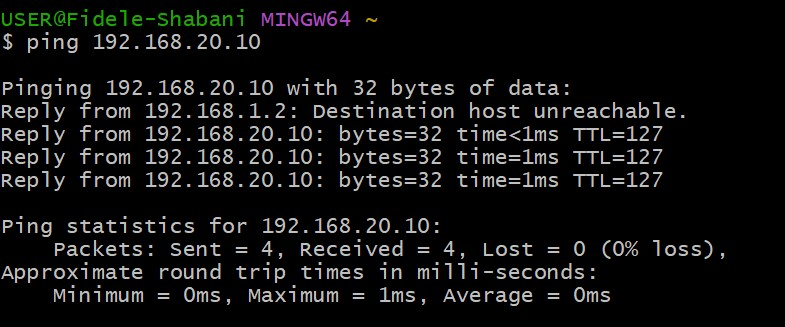

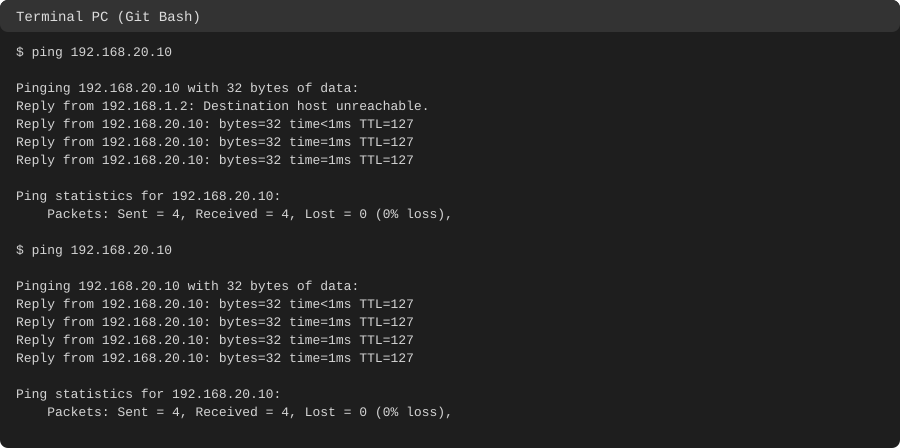

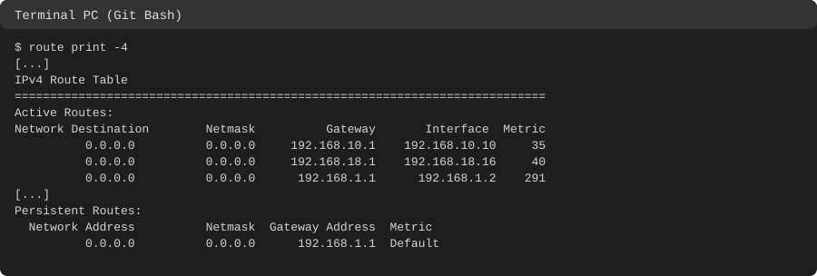

### 2. Filtre `include` mal écrit

Un premier `show running-config | include hostname | ip routing | interface vlan` n'a affiché que le nom du switch. Dans un filtre `include`, `|` sépare les motifs, les espaces font partie des motifs et la casse compte : `interface Vlan` (avec un V majuscule) et `ip routing` (sans espace avant) étaient nécessaires. Une absence de résultat dans un filtre ne prouve donc rien tant que le filtre n'est pas correct.

## Sauvegarde

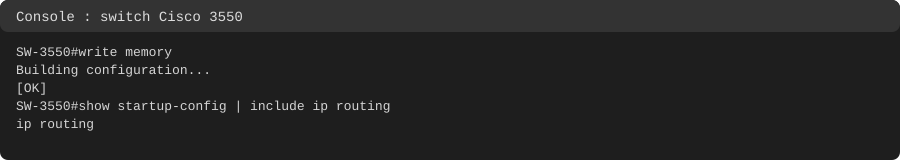

Extrait de la configuration finale :

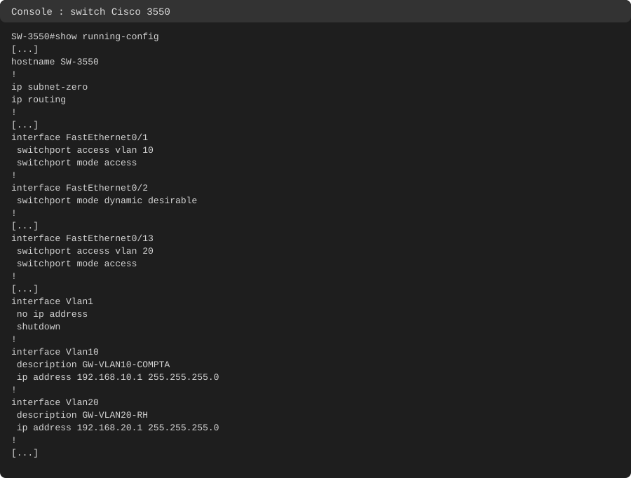

Les ports non utilisés sont en `switchport mode dynamic desirable`, la valeur par défaut du 3550. Cela ne gêne pas ce projet, mais en production on mettrait ces ports en `access` et en `shutdown` : un port en négociation dynamique peut devenir un trunk si on y branche un équipement.

## Router-on-a-stick et SVI : comparaison

| | Router-on-a-stick | SVI |
|---|---|---|
| Où se fait le routage | Dans un routeur externe | Dans le switch multilayer |
| Liaison entre le switch et le routeur | Un trunk 802.1Q | Aucune |
| Où se trouve l'IP de la passerelle | Sur une sous-interface du routeur, avec `encapsulation dot1Q N` | Sur `interface vlan N`, sans `encapsulation` |
| Chemin d'un paquet entre VLAN | Traverse le trunk deux fois (un tag à l'aller, un autre au retour) | Reste dans le switch |
| Limite | Un seul câble partagé par tous les VLAN | Demande un switch de niveau 3 et `ip routing` |
| Usage typique | Petit site avec un switch de niveau 2 et un routeur, labo, examens | Réseaux de campus et d'entreprise |

## Ce que j'ai retenu

- Une SVI est une interface virtuelle de couche 3 (`interface vlan N`) qui sert de passerelle à son VLAN.
- `ip routing` est désactivé par défaut sur un switch multilayer : sans lui, pas de routage entre VLAN.
- Une SVI passe en `up/up` quand le VLAN existe et qu'au moins un port actif lui appartient.
- Avec une SVI, le trunk, les sous-interfaces et l'aller-retour du paquet sur un câble partagé disparaissent.
- Le routage est visible dans la table : deux routes `C`, apparues sans commande `ip route`.
- Un switch de niveau 3 se reconnaît à `Running Layer2/3 Switching Image` dans `show version`, et au fait que `ip routing` est accepté.
- TTL 255 = l'équipement répond lui-même ; TTL 127 = le paquet a traversé un équipement de routage.
- Lire l'origine de chaque ligne de ping : un message d'erreur local peut être compté dans `Received`.
- Un filtre `include` doit être écrit exactement : casse, espaces et `|`.
- Un tracert ne distingue pas un routeur externe d'un switch qui route : le chemin vu de l'extérieur est le même.

## Compétences démontrées

- Identification d'un switch multilayer et vérification de son état initial.
- Création de VLAN et de ports access.
- Activation du routage de couche 3 et configuration de SVI.
- Vérification par `show ip route`, `show ip interface brief`, `show mac-address-table`.
- Utilisation de ping et tracert, lecture du TTL et de l'origine de chaque ligne.
- Lecture de la table de routage d'un PC pour analyser un incident.
- Sauvegarde et vérification de la startup-config.
- Documentation d'un projet réalisé sur du matériel réel.

## Remise en état

Sur PC-A (invite de commandes en administrateur) : supprimer la règle créée pendant le projet précédent.

```
netsh advfirewall firewall delete rule name="ICMP-TEST"
```

Sur les PC : remettre la carte Ethernet en IP automatique et réactiver le Wi-Fi.

Sur le 3550 :

```
write erase
delete flash:vlan.dat
reload
```

Le routeur 1841 reste éteint ou débranché tant que le 3550 est utilisé avec ces adresses.
