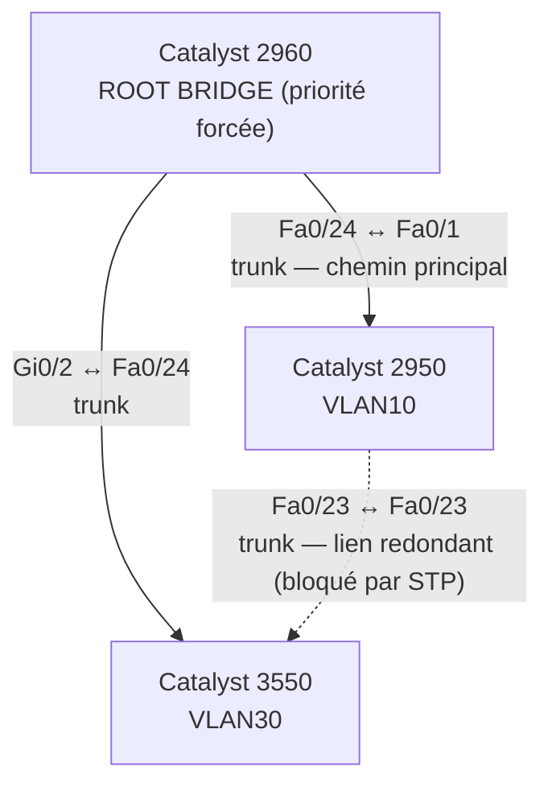
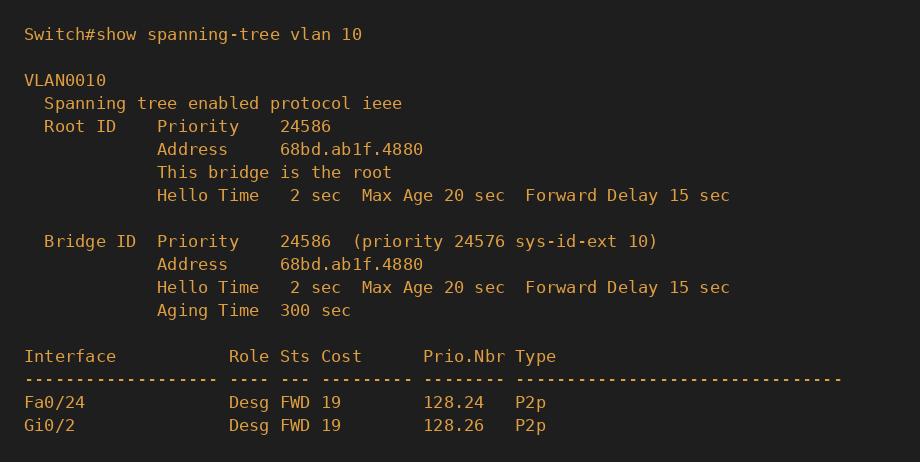
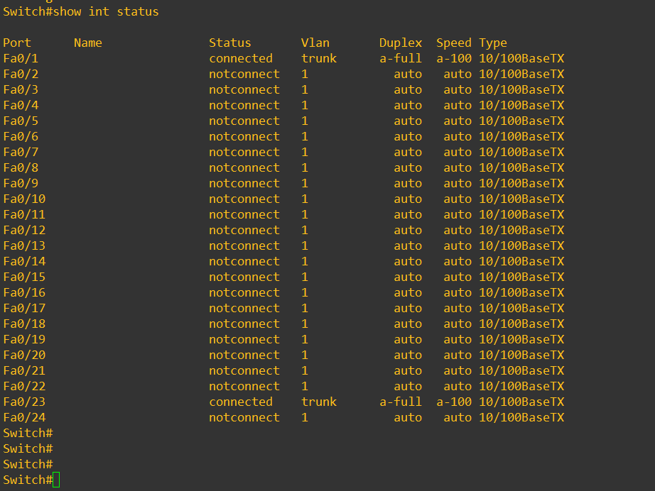
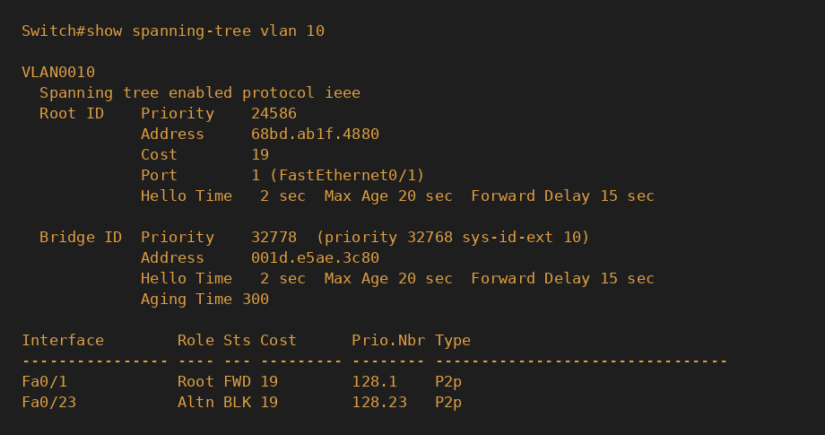
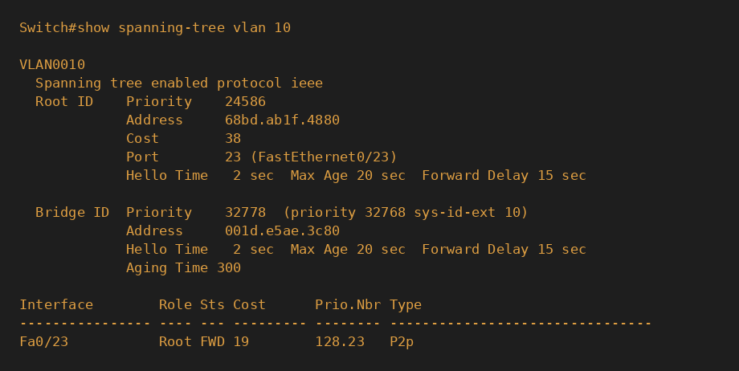
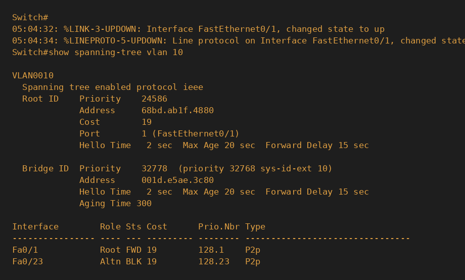

# Projet Réseau — Redondance et Spanning Tree Protocol (STP)

## 🎯 Objectif

Mettre en place une liaison redondante entre un switch de distribution et le
switch cœur de réseau, et démontrer que le protocole **Spanning Tree (STP)**
empêche la boucle qui en résulterait tout en assurant un **basculement
automatique** en cas de panne du lien principal — sans aucune intervention
manuelle et sans coupure de service prolongée.

## 🧰 Matériel utilisé

| Équipement | Rôle |
|------------|------|
| Cisco Catalyst 2960 | Switch cœur de réseau — root bridge forcé |
| Cisco Catalyst 2950 | Switch de distribution — lien redondant |
| Cisco Catalyst 3550 | Switch de distribution — lien redondant |
| Câble Ethernet croisé (fabriqué maison) | Liaison 2950 ↔ 3550 |
| Câble console RJ45 → USB | Accès CLI |

## 🗺️ Topologie



**Vérification :**


*Confirmation sur le 2960, juste avant fermeture de la boucle : les deux liens vers les switches de distribution sont Designated/Forwarding, aucun blocage nécessaire à ce stade.*

## ⚙️ Configuration appliquée

**Forcer le root bridge sur le switch cœur (2960) :**
```
spanning-tree vlan 10,20,30 root primary
```

**Trunks vers les deux switches de distribution (2960) :**
```
interface gigabitethernet 0/2
 switchport mode trunk

interface fastethernet 0/24
 switchport mode trunk
```

**Trunk vers le cœur (3550) :**
```
interface fastethernet 0/24
 switchport trunk encapsulation dot1q
 switchport mode trunk
```

**Trunk vers le cœur (2950) :**
```
interface fastethernet 0/1
 switchport trunk encapsulation dot1q
 switchport mode trunk
```

**Lien redondant, configuré des deux côtés avant câblage (2950 et 3550) :**
```
interface fastethernet 0/23
 switchport trunk encapsulation dot1q
 switchport mode trunk
```

> Méthode volontaire : toute la configuration logique (VLAN sur les 3
> switches, root bridge, trunks) a été mise en place **avant** de brancher
> le câble qui ferme la boucle, afin que STP ne fasse qu'un seul calcul de
> convergence propre au lieu de plusieurs recalculs successifs.

## 🐞 Incident rencontré et diagnostic — câble croisé nécessaire

**Symptôme :** après câblage du lien Fa0/23 (2950) ↔ Fa0/23 (3550) avec un
câble Ethernet droit standard, aucun des deux ports ne s'allumait
(`notconnect` des deux côtés), alors que le même câble fonctionnait
parfaitement entre chacun de ces switches et le Catalyst 2960.

**Démarche de diagnostic :**
1. Vérification de la configuration logique des deux ports (`show running-config interface`) → aucune anomalie, pas de `shutdown`.
2. Test du câble sur un lien connu fonctionnel (2950 → 2960) → le câble et le port du 2950 fonctionnent.
3. Test du même câble vers un autre port du 3550 (Fa0/22) → toujours aucun lien.
4. Test de la commande `mdix auto` pour forcer l'Auto-MDIX en logiciel → commande non supportée sur ce modèle (`% Invalid input detected`).

**Cause identifiée :** les Catalyst 2950 et 3550 sont des modèles plus
anciens **sans Auto-MDIX** sur leurs ports FastEthernet. Le Catalyst 2960
(plus récent) dispose de cette fonctionnalité et compense automatiquement le
type de câble, ce qui explique pourquoi les liens vers lui fonctionnaient
avec un câble droit standard — mais un lien **directement entre deux
switches sans Auto-MDIX** nécessite un câble **croisé (crossover)**.

**Résolution :** fabrication manuelle d'un câble croisé (norme T568B sur une
extrémité, T568A sur l'autre), testé et validé — le lien s'est établi
immédiatement après remplacement du câble.

**Leçon retenue :** l'absence de lien physique n'est pas toujours une panne
matérielle — le pinout du câble compte, surtout avec du matériel de
génération différente. Toujours isoler méthodiquement (config, câble, port)
avant de conclure à du matériel défectueux.

## 📸 Capture d'écran


*État du switch 2950 juste après la fermeture de la boucle : Fa0/1 (vers le 2960) et Fa0/23 (vers le 3550) sont tous les deux `connected` en trunk simultanément — la condition nécessaire pour que Spanning Tree ait une boucle à gérer.*

## 🧪 Résultats des tests

> Les 3 captures ci-dessous ont été reconstituées visuellement à partir des
> sorties de commande réelles obtenues pendant la session (mêmes valeurs,
> mêmes ports, même contenu exact), les captures d'écran natives n'ayant pas
> pu être prises au moment des tests.

**État stable après fermeture de la boucle — Fa0/23 bloqué :**



**Test de panne — débranchement du lien principal, basculement automatique :**



**Retour à la normale après rétablissement du lien principal :**



**Après fermeture de la boucle, état stable (`show spanning-tree vlan 10`) :**

| Switch | Port | Rôle | État |
|--------|------|------|------|
| 2950 | Fa0/1 (vers 2960) | Root | FWD |
| 2950 | Fa0/23 (vers 3550) | Alternate | **BLK** |

→ STP a détecté la boucle formée par les trois switches et a bloqué
logiquement le port redondant du 2950, tout en le gardant en veille active
(réception continue de BPDU).

**Test de basculement — débranchement du lien principal (2950 ↔ 2960) :**

```
Root ID    Cost   38
Port       23 (FastEthernet0/23)

Interface   Role Sts Cost
Fa0/23      Root FWD 19
```

→ En moins d'une minute, sans aucune commande manuelle, le port
auparavant bloqué est passé en `Root FWD` et a pris le relais. Le coût
total est passé de 19 à 38, reflétant le chemin plus long (2950 → 3550 →
2960 au lieu d'un lien direct).

**Test de rétablissement — rebranchement du lien principal :**

```
Fa0/1    Root FWD   19
Fa0/23   Altn BLK   19
```

→ Retour exact à l'état initial une fois le lien principal réparé,
confirmant que STP réagit dans les deux sens de façon cohérente.

## 📚 Compétences démontrées

- Conception d'une topologie redondante à 3 switches
- Configuration explicite d'un root bridge (bonne pratique vs élection automatique par adresse MAC)
- Ordonnancement méthodique d'une configuration complexe pour limiter les recalculs STP
- Diagnostic réseau physique rigoureux (élimination progressive : config → câble → port)
- Compréhension et résolution d'un problème de câblage Ethernet lié à l'absence d'Auto-MDIX
- Fabrication manuelle d'un câble réseau croisé (norme T568A/T568B)
- Lecture et interprétation des rôles et états de ports STP (`Root`, `Designated`, `Alternate`/`Blocking`)
- Validation d'un scénario de panne réel avec mesure du temps de convergence et du changement de coût de chemin

---
*Projet réalisé dans le cadre d'une formation pratique réseau — Bloc 3 : Switching, Notion 3 : Spanning Tree Protocol.*
