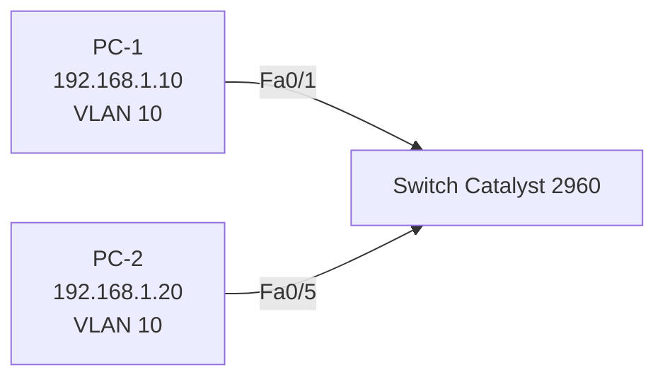
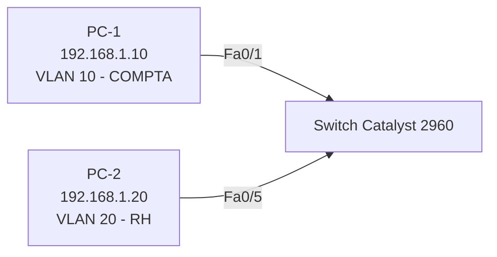

# Projet Réseau — Test d'isolation VLAN entre deux postes réels + Dépannage pare-feu

## 🎯 Objectif

Aller plus loin que le premier test VLAN (switch-vers-lui-même) en validant
l'isolation VLAN avec un scénario réaliste d'entreprise : **deux postes de
travail physiques** communiquant directement entre eux, d'abord dans le même
VLAN, puis dans des VLAN différents. Ce projet inclut également un vrai
diagnostic réseau rencontré en conditions réelles : un pare-feu Windows
bloquant les requêtes ICMP entrantes.

## 🧰 Matériel utilisé

| Équipement | Rôle |
|------------|------|
| Switch Cisco Catalyst 2960 (24 ports PoE) | Équipement configuré |
| PC-1 (Windows) | Poste "Comptabilité" |
| PC-2 (Windows) | Poste mobile, déplacé entre VLAN |
| Câble console RJ45 → USB | Accès CLI |

## 🗺️ Topologie

**Phase 1 — Même VLAN (test de connectivité) :**



**Phase 2 — VLAN différents (test d'isolation) :**



> Point important : le même sous-réseau IP (192.168.1.0/24) est conservé sur
> les deux PC dans les deux phases. Seul le VLAN change. Cela permet de
> prouver que c'est bien la segmentation VLAN — et non une différence
> d'adressage IP — qui bloque la communication.

## ⚙️ Configuration appliquée

**Phase 1 — Fa0/1 et Fa0/5 dans le même VLAN (10) :**
```
interface fastethernet 0/1
 switchport mode access
 switchport access vlan 10
exit

interface fastethernet 0/5
 switchport mode access
 switchport access vlan 10
exit
```

**Phase 2 — Déplacement de Fa0/5 vers le VLAN 20 :**
```
interface fastethernet 0/5
 switchport access vlan 20
end
```

## 🐞 Incident rencontré et dépannage : pare-feu Windows

**Symptôme observé (Phase 1, avant correction) :**
- PC-2 → PC-1 : ping réussi (3-4 réponses reçues)
- PC-1 → PC-2 : ping échoué (0 réponse, 100% de perte)

**Diagnostic :** un ping asymétrique (qui marche dans un sens mais pas
l'autre) alors que le switch confirme les deux ports "connected" dans le même
VLAN pointe presque toujours vers un **pare-feu logiciel** sur la machine qui
ne répond pas, plutôt qu'un problème réseau.

**Vérification côté switch (`show interfaces status`) :**
```
Fa0/1   connected   10   a-full  a-100  10/100BaseTX
Fa0/5   connected   10   a-full  a-100  10/100BaseTX
```
→ Le switch est irréprochable, le problème est donc côté hôte.

**Correction appliquée sur PC-2 (invite de commande en administrateur) :**
```
netsh advfirewall firewall add rule name="Allow ICMPv4" protocol=icmpv4:8,any dir=in action=allow
```
Cette règle autorise explicitement les requêtes ICMP Echo Request entrantes,
que Windows bloque par défaut sur les réseaux "publics"/non approuvés.

## 🧪 Résultats des tests

**Phase 1 — PC-1 et PC-2 dans le même VLAN (10), après correction pare-feu :**
```
Reply from 192.168.1.20: bytes=32 time=1ms TTL=128   (x4)
Packets: Sent = 4, Received = 4, Lost = 0 (0% loss)
```
→ ✅ Succès total — la connectivité de base et le pare-feu sont validés.

**Phase 2 — PC-2 déplacé en VLAN 20, PC-1 reste en VLAN 10 :**
```
Request timed out.   (x4)
Packets: Sent = 4, Received = 0, Lost = 4 (100% loss)
```
→ ❌ Échec total attendu — preuve directe que la segmentation VLAN isole le
trafic entre deux postes, indépendamment de leur adressage IP.

## 📚 Compétences démontrées

- Configuration de ports access sur switch Cisco pour un scénario multi-postes
- Test de connectivité réel entre deux machines physiques (pas seulement switch/PC)
- Diagnostic méthodique d'un problème réseau (élimination progressive : switch → hôte)
- Résolution d'un blocage pare-feu Windows via `netsh advfirewall`
- Démonstration rigoureuse de l'isolation VLAN, indépendante du plan d'adressage IP

---
*Projet réalisé dans le cadre d'une formation pratique réseau — Bloc 3 : Switching, Notion 1 : VLAN (approfondissement).*

Realisé Par Master IT Fidele SHABANI
