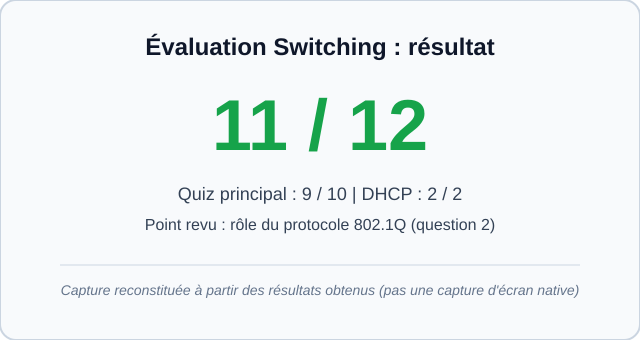

# Quiz d'évaluation : Bloc Switching

## Contexte

Ce quiz clôture le bloc **Switching** de ma formation pratique en réseau, réalisée sur du matériel Cisco physique (Catalyst 2960, 3550 et 2950), sans simulateur.

Il vérifie que je comprends les notions derrière les commandes, et pas seulement que je sais les taper.

## Notions évaluées

- VLAN
- Trunking 802.1Q
- Spanning Tree Protocol (STP)
- Auto-MDIX et câble croisé
- Port Security
- EtherChannel (LACP)
- DHCP

## Résultat

**Score : 11 / 12**

| Partie | Score |
|---|---|
| Quiz principal (VLAN, trunk, STP, Port Security, EtherChannel) | 9 / 10 |
| Questions DHCP | 2 / 2 |

**Point revu :** une erreur sur le rôle du protocole 802.1Q. La notion a été revue et corrigée après le quiz.

*Image reconstituée à partir des résultats obtenus, ce n'est pas une capture d'écran native du quiz.*

## Organisation du dossier

- `README.md` : les questions et le résultat
- `corrige.md` : les réponses et les explications
- `assets/` : captures d'écran

---

## Questions

### Partie 1 : Switching (questions 1 à 10)

**Question 1.** Deux PC sont branchés sur le même switch 2960, l'un dans le VLAN 10, l'autre dans le VLAN 20. Pourquoi ne peuvent-ils pas se pinguer ?

- A. Parce que le switch est en panne
- B. Parce que chaque VLAN est un domaine de broadcast et un réseau IP distincts, et qu'un switch L2 ne route pas entre eux
- C. Parce que les ports sont en mode trunk
- D. Parce que le DHCP n'est pas activé

**Question 2.** Que fait le protocole 802.1Q sur un lien trunk ?

- A. Il insère dans la trame Ethernet un tag de 4 octets contenant l'identifiant du VLAN
- B. Il crée un nouveau VLAN automatiquement
- C. Il regroupe plusieurs câbles en un seul lien logique
- D. Il bloque les boucles entre switches

**Question 3.** Comment le root bridge est-il élu dans le Spanning Tree Protocol ?

- A. Le switch avec le plus grand nombre de ports
- B. Le switch le plus récent
- C. Le switch avec le plus petit Bridge ID (priorité, puis adresse MAC en cas d'égalité)
- D. Le switch avec la plus grande adresse MAC

**Question 4.** Dans un triangle de 3 switches, pourquoi STP bloque-t-il un port (Altn/BLK) ?

- A. Pour économiser de la bande passante
- B. Parce que le câble est défectueux
- C. Pour donner la priorité au trafic du VLAN 10
- D. Pour supprimer la boucle de couche 2 et éviter les tempêtes de broadcast, tout en gardant un lien de secours

**Question 5.** Un lien direct 2950 ↔ 3550 n'a fonctionné qu'avec un câble croisé. Quelle en est la raison ?

- A. Ces deux switches n'ont pas d'Auto-MDIX sur leurs ports FastEthernet
- B. STP interdit les câbles droits
- C. Le trunk 802.1Q exige un câble croisé
- D. Le 3550 est un switch de couche 3

**Question 6.** Que fait Port Security en mode « sticky » ?

- A. Il bloque tous les appareils par défaut
- B. Il apprend dynamiquement les adresses MAC connectées et les enregistre dans la configuration
- C. Il chiffre le trafic du port
- D. Il attribue une adresse IP fixe au PC

**Question 7.** Un port est passé en err-disabled après une violation de Port Security. Comment le remettre en service (une fois l'appareil non autorisé retiré) ?

- A. Redémarrer tout le switch obligatoirement
- B. Changer le câble
- C. Faire `shutdown` puis `no shutdown` sur l'interface
- D. Supprimer le VLAN du port

**Question 8.** Port Security a été appliqué par erreur sur un port trunk. Pourquoi est-ce un problème ?

- A. Le trunk n'accepte aucune commande de sécurité
- B. Un trunk transporte les MAC de nombreux appareils, ce qui dépasse la limite de Port Security et provoque un blocage du lien
- C. Cela désactive le protocole STP
- D. Cela supprime le tag 802.1Q

**Question 9.** Quelle combinaison de modes LACP permet de former un EtherChannel ?

- A. passive côté 2960 et passive côté 3550
- B. Aucune, LACP exige le mode « on »
- C. passive uniquement d'un côté, l'autre côté sans EtherChannel
- D. active côté 2960 et passive côté 3550 (ou active des deux côtés)

**Question 10.** Quel est l'effet d'un EtherChannel sur STP (2960 ↔ 3550 sur 2 câbles) ?

- A. Un des deux câbles est bloqué par STP
- B. STP est désactivé sur les deux switches
- C. STP voit le Port-channel comme un seul lien logique, donc plus aucun port n'est bloqué entre ces deux switches
- D. STP double le coût du lien

### Partie 2 : DHCP (questions 11 et 12)

**Question 11.** Quel est l'ordre correct des messages échangés quand un PC obtient une adresse IP via DHCP ?

- A. Offer, Discover, Acknowledge, Request
- B. Discover, Request, Offer, Acknowledge
- C. Discover, Offer, Request, Acknowledge
- D. Request, Discover, Acknowledge, Offer

**Question 12.** Sur un switch Cisco configuré en serveur DHCP, à quoi sert la commande `ip dhcp excluded-address` ?

- A. À interdire à certains PC d'utiliser le DHCP
- B. À supprimer un pool DHCP existant
- C. À chiffrer les échanges DHCP
- D. À réserver des adresses du pool (passerelle, équipements fixes) pour qu'elles ne soient pas distribuées aux clients
